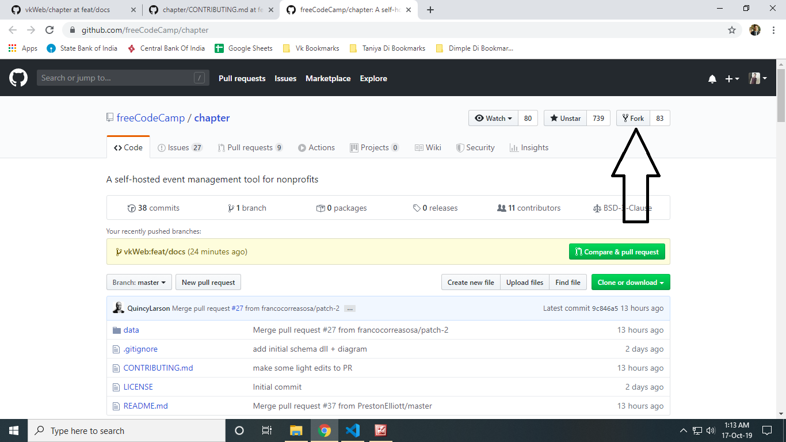
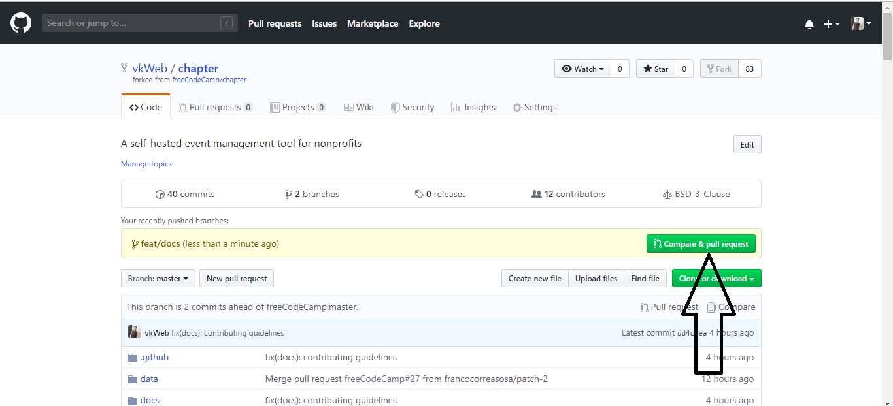
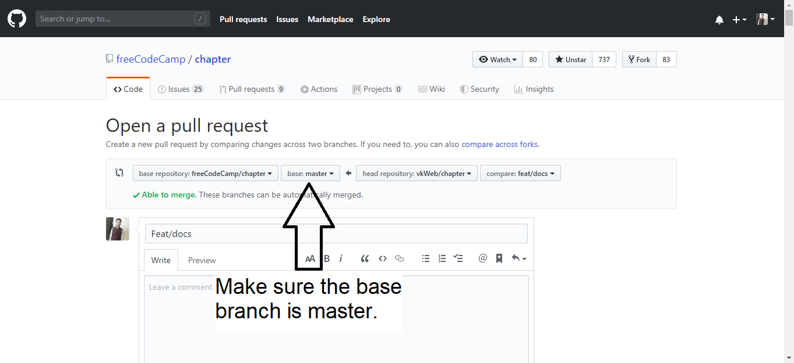

**Table of Contents**

- [Contribution Guidelines](#contribution-guidelines)
- [Contributing Code](#contributing-code)
  - [Using GitPod](#using-gitpod)
  - [Using a Traditional Dev Environment](#using-a-traditional-dev-environment)
- [Running the Application](#running-the-application)
  - [Docker Mode](#docker-mode)
  - [Manual Mode](#manual-mode)
- [Frequently Asked Questions](#frequently-asked-questions)
- [Server-side Technical Documentation](#server-side-technical-documentation)
  - [API Specification](#api-specification)
  - [.env Configuration File](#env-configuration-file)
  - [Database](#database)
    - [Schema](#schema)
    - [Username and Password](#username-and-password)
    - [Host and Port](#host-and-port)
    - [Admin Tools](#admin-tools)
    - [Using TypeORM and NPM](#using-typeorm-and-npm)
      - [Initializing the Database](#initializing-the-database)
      - [Creating a New Model / Entity](#creating-a-new-model--entity)
      - [Creating a Migration](#creating-a-migration)
      - [Running Migrations and Checking They Were Run](#running-migrations-and-checking-they-were-run)
- [Running Remotely](#running-remotely)
- [Troubleshooting](#troubleshooting)
    
# Contribution Guidelines

Hello :wave: and welcome to **_Chapter_**, a project of [freeCodeCamp](https://www.freecodecamp.org).

We strictly enforce our ["Code of Conduct"](https://www.freecodecamp.org/code-of-conduct), so please take a moment to read the 196 word policy.

[Join our chat](https://chat.freecodecamp.org/channel/chapter) to get connected with the project's development team.

# Contributing Code

Consider the following options when you are ready to contribute code.
* [GitPod.io](https://www.gitpod.io/docs) - a ready-to-code development environment that launches in the cloud.
* Traditional Dev Environment - the common method of developing on a computer you control.

## Using GitPod

All [pull requests](https://github.com/freeCodeCamp/chapter/pulls) will have a GitPod link to allow for quickly opening an "ready-to-code" development environment for that specific issue / task. Follow the [GitPod documentation](https://www.gitpod.io/docs) to configure your account and "ephemeral" workspace.

## Using a Traditional Dev Environment

This approach is more common and involves the step below to setup and configuring a development environment within a local, virtual, or remote operating system that you own or control.

<details><summary>Step 1 - Fork the Repository on GitHub</summary>

['Forking'](https://help.github.com/articles/about-forks/) is a step where you get your own copy of **_Chapter's_** repository (a.k.a repo) on GitHub.

This is essential as it allows you to work on your own copy of **_Chapter_**. It allows you to request changes to be pulled into the **_Chapter's_** repository from your fork via a pull request.

Follow these steps to fork the repository:
1. Go to the [Chapter repository on GitHub](https://github.com/freeCodeCamp/chapter).
2. Click the "Fork" Button in the upper right-hand corner of the interface [Need help?](https://help.github.com/articles/fork-a-repo/).
3. After the repository has been forked, you will be taken to your copy of the **_Chapter_** repository at `https://github.com/YOUR_USER_NAME/chapter`.


</details>

<details><summary>Step 2 - Prepare the Development Environment</summary>

**Prerequisite**:  All `commands` will be run within a terminal's command line / shell on your development device. Options vary by operating system.

* Linux - the pre-installed terminal, usually running a _bash_ or _sh_ shell, should work in its default "out of the box" configuration.
* Mac - the pre-installed _Terminal_ in MacOS, usually running a zsh shell, should work in its default "out of the box" configuration.
* Windows - options for running a Linux terminal and shell within Windows include:
    * [Windows Subsystem Linux with Linux (WSL)](https://docs.microsoft.com/en-us/windows/wsl/install-win10#manual-installation-steps) with a Linux distribution, such as [_Ubuntu 20.04 for Windows_](https://ubuntu.com/tutorials/ubuntu-on-windows) or [other supported Linux distributions](https://docs.microsoft.com/en-us/windows/wsl/install-win10#step-6---install-your-linux-distribution-of-choice).
        > Note: [Windows Terminal](https://www.microsoft.com/en-us/p/windows-terminal/) is an **optional** terminal interface tool. It can only open a Linux shell if WSL and a Linux distro already exist.
    * _Git Bash_ - this terminal shell emulates Linux and is included in _Git for Windows_. It works, but is more likely to have permission errors or minor inconsistencies.
    * _PowerShell_ and _cmd_ may run the **_Chapter_** app in _Docker Mode_, but these Windows native shells are not supported for this project.

**Prerequisite**: [Git](https://git-scm.com/downloads) must exist (run ``git --version`` to check) within your development terminal / shell.

1. Decide if you will [authenticate to GitHub using SSH or HTTPS](https://docs.github.com/en/github/authenticating-to-github/about-authentication-to-github#authenticating-with-the-command-line).
    * SSH - uses SSH key authentication instead of a username and password.
    * HTTPS - uses a GitHub username and [personal access token (PAT)](https://docs.github.com/en/github/authenticating-to-github/creating-a-personal-access-token).  For security, use a PAT instead of a GitHub password.

2. Change directories (`cd`) to wherever you want the **_Chapter_** project to be downloaded by Git.
    > Note: Windows using WSL + a Linux distro maintains its own file system. Use a sub-directory within the Linux /home/username/ filesystem path. The alternative, using a directory within _C:\_ or _/mnt/c_, will cause everything to run very slowly.

3. [Clone](https://docs.github.com/en/github/getting-started-with-github/about-remote-repositories) your GitHub fork of **_Chapter_** using the SSH or HTTP method you selected above. Replace _YOUR_USER_NAME_ with your GitHub username.

    * [SSH method](https://docs.github.com/en/github/getting-started-with-github/about-remote-repositories#cloning-with-ssh-urls) - `git clone git@github.com:YOUR_USER_NAME/Chapter.git`
    * [HTTPS method](https://docs.github.com/en/github/getting-started-with-github/about-remote-repositories#cloning-with-https-urls) - `git clone https://github.com/YOUR_USER_NAME/chapter.git`
 
     This command will download the entire Git repository fork into a sub-directory named _chapter_ inside of the current directory. Your forked repository of code will be referred to as the _origin_ . 

4. Configure the [**_Chapter_**](https://github.com/freeCodeCamp/chapter) repository as the _upstream_. Doing this allows you to regularly synchronize code changes from the _upstream_ to your _origin_ fork.

    ```sh
    cd chapter
    git remote add upstream https://github.com/freeCodeCamp/chapter.git
    ```

5. Ensure the _origin_ and _upstream_ configuration is correct:

    ```sh
    git remote -v
    ```

    The output should look something like below:

        origin    https://github.com/YOUR_USER_NAME/chapter.git (fetch)
        origin    https://github.com/YOUR_USER_NAME/chapter.git (push)
        upstream    https://github.com/freeCodeCamp/chapter.git (fetch)
        upstream    https://github.com/freeCodeCamp/chapter.git (push)

</details>

<details><summary>Step 3 - Decide Whether to Run the Application Now, or Later</summary>

It's possible to contribute simple changes, like to README.md, without running the application. However, for many situations you will need to get the application running to view pages, see your code in action, and test changes.  

If you want to proceed immeditely with running the client, database, and server, then follow the steps in the [**Running the Application**](#running-the-application) section, below. Then, return here and continue to the next step of this section. 

</details>

<details><summary>Step 4 - Make Changes and Test the Code :fire:</summary>

You are almost ready to make changes to files, but before that you should **always** follow these steps:

1. Validate that you are on the _master_ branch

    ```sh
    git status
    ```

    You should get an output like this:
    
        On branch master
        Your branch is up-to-date with 'origin/master'.
        nothing to commit, working directory clean

    If you are not on master or your working directory is not clean, resolve any outstanding files/commits and checkout _master_:

    ```sh
    git checkout master
    ```

2. Sync the latest changes from the upstream **Chapter** _master_ branch to your local fork's _master_ branch. This is very important to keep things synchronized and avoid "merge conflicts".

    > Note: If you have any outstanding Pull Request that you made from the _master_ branch of your fork, you will lose them at the end of this step. You should ensure your pull request is merged by a moderator before performing this step. To avoid this scenario, you should *always* work on a branch separate from master.

    This step **will sync the latest changes** from the main repository of chapter.

    Update your local copy of the freeCodeCamp upstream repository:
    ```sh
    git fetch upstream
    ```

    Hard reset your master branch with the chapter master:
    ```sh
    git reset --hard upstream/master
    ```

    Push your master branch to your origin to have a clean history on your fork on GitHub:
    ```sh
    git push origin master --force
    ```

    You can validate if your current master matches the upstream/master or not by performing a diff:
    ```sh
    git diff upstream/master
    ```

    If you don't get any output, you are good to go to the next step.

3. Create a fresh new branch

    Working on a separate branch for each issue helps you keep your local work copy clean. You should never work on the _master_ branch. This will soil your copy of **_Chapter_** and you may have to start over with a fresh clone or fork.

    Check that you are on _master_ as explained previously, and branch off from there by typing:
    ```sh
    git checkout -b fix/update-readme
    ```

    Your branch name should start with _fix/_, _feat/_, _docs/_, etc. Avoid using issue numbers in branches. Keep them short, meaningful and unique.

    Some examples of good branch names are:

    * fix/update-nav-links
    * fix/sign-in
    * docs/typo-in-readme
    * feat/sponsors

4. Edit files and write code on your preferred code editor, such as [VS Code](https://code.visualstudio.com/).

    Then, check and confirm the files you are updating:

    ```sh
    git status
    ```

    This should show a list of _unstaged_ files that you have edited.

        On branch feat/documentation
        Your branch is up to date with 'upstream/feat/documentation'.

        Changes not staged for commit:
        (use "git add/rm <file>..." to update what will be committed)
        (use "git checkout -- <file>..." to discard changes in working directory)

        modified:   CONTRIBUTING.md
        modified:   README.md
        ...

5. Always Run Code Quality Tools 

    Verify all automated code quality checks will pass before submitting a pull request because PRs with failures will not be merged.

    * When using _Docker Mode_, run `NODE_ENV=test docker-compose exec app npm run lint-and-test` OR `NODE_ENV=test docker-compose exec app npm run test:watch` to start "watch" mode.
    * When using _Manual Mode_, run `npm run lint-and-test` OR `npm run test:watch` to start "watch" mode.
 
6. Stage the changes and make a commit

    In this step, you should only mark files that you have edited or added yourself. You can perform a reset and resolve files that you did not intend to change if needed.

    ```sh
    git add path/to/my/changed/file.ext
    ```

    Or, you can add all the _unstaged_ files to the staging area using the below handy command:

    ```sh
    git add .
    ```

    Only the files that were moved to the staging area will be added when you make a commit.

    ```sh
    git status
    ```

    Output:

        On branch feat/documentation
        Your branch is up to date with 'upstream/feat/documentation'.

        Changes to be committed:
        (use "git reset HEAD <file>..." to unstage)

        modified:   CONTRIBUTING.md
        modified:   README.md

    Now, you can commit your changes with a short message like so:

    ```sh
    git commit -m "fix: my short commit message"
    ```

    We highly recommend making a conventional commit message. This is a good practice that you will see on some of the popular Open Source repositories. As a developer, this encourages you to follow standard practices.

    Some examples of conventional commit messages are:

    * fix: update API routes
    * feat: RSVP event
    * fix(docs): update database schema image

    Keep your commit messages short. You can always add additional information in the description of the commit message.

7. Next, you can push your changes to your fork.

    ```sh
    git push origin branch-name-here
    ```

    For example if the name of your branch is _fix/signin_ then your command should be:
    ```sh
    git push origin fix/signin
    ```
</details>

<details><summary>Step 5: Propose a Pull Request (PR)</summary>

When opening a Pull Request(PR), use the following scope table to decide what to title your PR in the following format:

_fix/feat/chore/refactor/docs/perf (scope): PR Title_

An example is _feat(client): night mode_.

| Scope | Documentation |
|---|---|
| _api_ | For Pull Requests making changes to the APIs, routes and its architecture |
| _db_ | For Pull Requests making changes related to database |
| _client_ | For Pull Requests making changes to client platform logic or user interface |
| _docs_ | For Pull Requests making changes to the project's documentation |

1. Once the edits have been committed & pushed, you will be prompted to create a pull request on your fork's GitHub Page. Click on _Compare and Pull Request_.

    

2. By default, all pull requests should be against the **_Chapter_** main repo, _master_ branch.

    

3. Submit the pull request from your branch to **_Chapter's_** _master_ branch.

4. In the body of your PR include a more detailed summary of the changes you made and why.

    - You will be presented with a pull request template. This is a checklist that you should have followed before opening the pull request.

    - Fill in the details as they seem fit to you. This information will be reviewed and a decision will be made whether or not your pull request is going to be accepted.

    - If the PR is meant to fix an existing bug/issue then, at the end of
      your PR's description, append the keyword _closes_ and #xxxx (where xxxx
      is the issue number). Example: _closes #1337_. This tells GitHub to
      automatically close the existing issue, if the PR is accepted and merged.

You have successfully created a PR. Congratulations! :tada:
</details>

# Running the Application
**Prerequisite**: Follow steps 1 and 2 of the [**Contributing Code**](#contributing-code) section, above, before continuing to the next step in this section.

<details><summary>Step 1 - Install Node.js and Run npx</summary>
 
**Prerequisite**: [Node.js](https://nodejs.org/en/download/) must exist on your system.
> Note: Close and re-open your terminal after the installation finishes.

Ensure the Node.js tools are installed:

* Node.js 14 or greater - `node --version` and the output should be like **v14**.16.0
* npm 6 or greater - `npm --version` and the output should be like **6**.14.11

Run `npx recursive-install` to install all of the necessary dependencies.

This step will **automatically** read and process the _package.json_ file. Most notably it:
* Downloads all Node package dependencies to the _node_modules_ sub-directory
* Creates the [_.env_ configuration file](#env-configuration-file) if one does not exist.
    > Note: this is done "magically" via the _postinstall_ hook.
</details>
    
<details><summary>Step 2 - Run the App Using Docker Mode OR Manual Mode</summary>

There are two approaches to running the **_Chapter_** application. 

Based on your experience or preference, decide between the two options:

* _Docker Mode_: typically easier if you just want to start the application for the first time or don't want to run a local PostgreSQL database on your host computer. It will take longer to "boot up" the container than manual-mode and can be slow to reload some types of code changes.  
* _Manual Mode_: more of a "hands-on" method, is more lightweight in that it's faster to "boot" and faster to refresh for some code changes, requires more knowledge of running PostgreSQL and configuring localhost services to play nice with the code.

See [Running Remotely](#running-remotely) if you are using a remote server.
## Docker Mode

**Prerequisite**: [Docker](https://docs.docker.com/get-docker/) must exist on your system:
* Windows - [Docker Desktop](https://hub.docker.com/editions/community/docker-ce-desktop-windows)
    > Note: Close and re-open your terminal after the installation finishes.
* Mac - [Docker Desktop](https://docs.docker.com/docker-for-mac/install/)
* Linux
    * [Docker Engine](https://docs.docker.com/engine/install/#server)
    * [Docker Compose](https://docs.docker.com/compose/install/)

Ensure the Docker tools are installed:
* _Docker_ using `docker --version` and it should output something like _Docker version 19.03.13..._
* _Docker Compose_ using `docker-compose --version` and it should output something like _docker-compose version 1.28.5..._

Make sure _IS_DOCKER=TRUE_ is set in [_.env_](#env-configuration-file).

Run _Docker Compose_ `docker-compose up` from the root code directory and wait for the successful output as shown in the following example.
> Note: This could take minutes for each line to appear.

    db_1      | ... LOG:  database system is ready to accept connections
    client_1  | ready - started server on http://localhost:3000
    app_1     | Listening on http://localhost:5000/graphql

Once Docker is running:
* The server will automatically restart anytime you save a _.ts_ or _.js_ file within the _server/_ directory.
* You can run any command within the container by prefixing it with `docker-compose exec app`, e.g. `docker-compose exec app npm install express`
* If you, or someone else via a commit, updates _Dockerfile_ or the contents of its build directory, run `docker-compose build` to get the new image. Then, run `docker-compose up` to start the container's services. 

Proceed to the **Prepare the Database for Development** step, below.

## Manual Mode

This is a much lighter development footprint than _Docker Mode_, but you will need to manually manage the client-server, database, and API server.

**Prerequisite**: PostgreSQL must exist and be [configured](#database).

Set _IS_DOCKER=_ to blank in [_.env_](#env-configuration-file). 

Run `npm run both` to start the api-server and client-server:

Proceed to the **Prepare the Database for Development** step, below.
</details>

<details><summary>Step 3 - Prepare the Database for Development</summary>
The database may be empty or need to be recreated to get schema changes.
    
See the [Initializing the Database](#initializing-the-database) section, below, before continuing to the next step in this section.
</details>

<details><summary>Step 4 - View the Running Application</summary>
Once the app has started you should be able to pull up these URLs in your web browser:

* Main Client Website - http://localhost:3000
* GraphQL Playground - http://localhost:5000/graphql

</details>

# Frequently Asked Questions

<details><summary>What do we need help with right now?</summary>

We are in the very early stages of development on this new application. We value your insight and expertise.  In order to prevent duplicate issues, please search through our existing issues to see if there is one for which you would like to provide feedback. We are currently trying to consolidate many of the issues based on topics like documentation, user interface, API endpoints, and architecture. Please [join our chat](https://chat.freecodecamp.org/channel/chapter) to stay in the loop.
</details>

<details><summary>I found a typo. Should I report an issue before I can make a pull request?</summary>

For typos and other wording changes, you can directly open pull requests without first creating an issue. Issues are more for discussing larger problems associated with code or structural aspects of the application.
</details>
    
<details><summary>I am new to GitHub and Open Source, where should I start?</summary>

Read our [How to Contribute to Open Source Guide](https://github.com/freeCodeCamp/how-to-contribute-to-open-source).

We are excited to help you contribute to any of the topics that you would like to work on. Feel free to ask us questions on the related issue threads, and we will be glad to clarify. Make sure you search for your query before posting a new one. Be polite and patient. Our community of volunteers and moderators are always around to guide you through your queries.

When in doubt, you can reach out to current project lead(s):

| Name            | GitHub | Role |
|:----------------|:-------|:-----|
| Fran Zeko | [@Zeko369](https://github.com/Zeko369) | Admin UI, routes, models, and data migrations
| Ayotomide Oladipo | [@tomiiide](https://github.com/tomiiide) | Public-facing client pages / forms
| Timmy Chen | [@timmyichen](https://github.com/timmyichen) | API
| Patrick San Juan | [@pdotsani](https://github.com/pdotsani) | Google Authentication
| Jonathan Seubert | [@megajon](https://github.com/megajon) | Email
| Vaibhav Singh | [@vaibhavsingh97](https://github.com/vaibhavsingh97) | Heroku 1-click deployment
| Jim Ciallella | [@allella](https://github.com/allella) | Documentation
| Quincy Larson | [@QuincyLarson](https://github.com/QuincyLarson) | Executive Lead

You are a champion :).

</details>

# Server-side Technical Documentation

## API Specification

We use [GraphQL](https://graphql.org/) to define the API structure of the application.

The GraphQL Playground has "Docs" and "Schema" tabs on the right side of the page. You can see them:
* If you are already [**Running the Application**](#running-the-application) at http://localhost:5000/graphql
* If you don't have a running app at [GraphQL Playground](https://chapter-server.herokuapp.com/graphql). (Note, this is a free-tier of Heroku. Hit refresh every minute or two if the page fails to load and it should eventually "wake" the server.)

## .env Configuration File

An important, local _.env_ configuration file exists in the root code directory. It's used to store [environment variables](https://en.wikipedia.org/wiki/Environment_variable) and their associated values.

Any changes to _.env_ **will not and should not** be committed into your _origin_ fork or the _Chapter_ _upstream_. Plus, a _.gitignore_ rule exists to prevent it. Do not remove this rule or otherwise attempt to commit your _.env_ to any Git repository.

Keeping your _.env_ out of the repositories is important because the file will contain "secrets" (usernames, passwords, API keys) and other values which are specific to you and your local development environment. 

The _.env_ file is automatically created via the [**Running the Application**](#running-the-application) section when you follow **Step 1 - Install Node and Run npx**. 

This configuration pattern is based on the [dotenv package](https://www.npmjs.com/package/dotenv) and is also popular in other frameworks and programming languages.

The initial values of the _.env_ will be copied from the _.env.example_ file. However, you should **not** attempt to add any of your personal configuration values / secrets to the _.env.example_ file. The purpose of _.env.example_ is as a template to declare any variable names the application will need and any values in it are "dummy" / example values purely as a guide to help other developers with their _.env_ file. 

## Database

[PostgreSQL](https://www.postgresql.org/download) is our database and [TypeORM](https://typeorm.io/) is used to map tables to JS objects.

### Schema
Our [database schema](https://freecodecamp.github.io/chapter/) and [ER Diagram](https://freecodecamp.github.io/chapter/relationships.html) are hosted online on a GitHub pages domain.

This is [currently manually generated and updated](https://github.com/freeCodeCamp/chapter/issues/54#issuecomment-799653569) on the _gh-pages_ branch by running [SchemaSpy](http://schemaspy.org/).

### Username and Password
* Set your specific values in [_.env_](#env-configuration-file).
* For security, it's ideal to change the username and password from the default values.

### Host and Port
* In **Docker Mode**, the Docker database container will be exposed to the host computer on Host: _localhost_ and Port: _54320_. Thus, avoiding potential port conflicts in the case your computer is running PostgreSQL locally for other projects.
* In **Manual Mode**, the PostgreSQL port will be as you configured it, the default being Host: _localhost_ and Port: _5432_
* If you're using a remote PostgreSQL server, like [ElephantSQL](https://www.elephantsql.com/), then the Host and Port will be provided by the service. You'll also need to update the `DB_URL` value in [_.env_](#env-configuration-file).

### Admin Tools 
* [pgAdmin](https://www.pgadmin.org/), [Postico](https://eggerapps.at/postico/) or [Table Plus](https://tableplus.com/), can use your mode's **Host and Port** values as described above.
* psql Client
  * In **Docker Mode** - `psql -h localhost -p 54320 -U postgres`. You don't have to run `docker-compose exec...` commands to "talk" to the PostgreSQL container.
  * In **Manual Mode** - `psql -h localhost -p 5432 -U postgres` 

### Using TypeORM and NPM

Our DB commands closely mirror their Rails counterparts (there isn't anything quite similar to ActiveRecord and RailsCLI in node yet, so till then #rails 🚋 )

`npm run db:generate NAME` -> `rake db:generate NAME`, note that this command checks for the diff between models and db, unlike rails where you need to specify the migration by hand
`npm run db:migrate` -> `rake db:migrate`
`npm run db:seed` -> `rake db:seed`
`npm run db:reset` -> `rake db:reset`

#### Initializing the Database

If you're starting the application for the first time, or syncronizing with the latest development changes, then you like need to:
* drop the database - to delete all the structure and data
* migrate the database - to structure by setup tables based on the schema
* seed the database - development is easier with a database full of example entities. The process of creating example entities in the database is called seeding

The `npm run db:reset` command will do all three tasks: drop, migrate, and seed.

If you prefer to run some or all of the steps manually, then they are:
* `npm run db:drop`
* `npm run db:migrate`
* `npm run db:seed`

#### Creating a New Model / Entity

`npm run typeorm entity:create -- --name=ModelName`

This would create _ModelName.ts_ in _server/models_

To keep everything DRY, add `extends BaseModel` to the class and import it from 'server/models/BaseModel' to no repeat id, createdAt, and updatedAt fields on every single model

You could also run `npx typeorm` since here you're not actually loading any ts files, but because regular `npx typeorm` runs inside of node it import from _.ts_ files, so we run it with `ts-node` and our custom server config (check package.json)

#### Creating a Migration

After you created a new model or updated an existing one, you need to generate a migration for those changes. To do so run:

`npm run db:generate MIGRATION_NAME`

Since this runs a compare agains the current db schema, you need to have the DB running (If you're using docker-compose, you need to have that running).

After that, check the generated SQL in _db/migrations/date-MigrationName.ts_

#### Running Migrations and Checking They Were Run

You can manually run them by doing
`npm run db:migrate`

and then check if it happened correctly

`npm run typeorm migration:show`

it should ouput something like

```
 [X] Chapter1574341690449
 ...
 [X] MigrationName1575633316367
```

# Running Remotely

When not running locally, the client needs to be passed the server's location by changing your [_.env_](#env-configuration-file) file to include `NEXT_PUBLIC_APOLLO_SERVER=<https://address.of.graphql.server:port>`.  For example, if you started **_Chapter_** with `npm run both` and hosted it on `https://example.com` then the address will be `https://example.com:5000`.

# Troubleshooting

Visit our [chat](https://chat.freecodecamp.org/channel/chapter) for assistance. Or, [create an issue for new bugs or topics](https://github.com/freeCodeCamp/chapter/issues).
