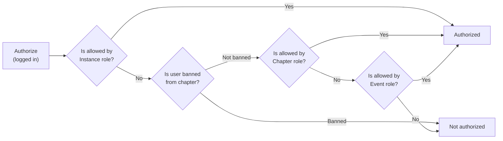

**Table of Contents**

- [Contribution Guidelines](#contribution-guidelines)
- [Contributing Code](#contributing-code)
  - [Using GitPod](#using-gitpod)
  - [Using a Traditional Dev Environment](#using-a-traditional-dev-environment)
- [Running the Application](#running-the-application)
  - [Docker Mode](#running-the-application)
  - [Manual Mode](#running-the-application)
- [Adding a New Feature](#adding-a-new-feature)
  - [Where to Find the Code](#where-to-find-the-code)
- [Frequently Asked Questions](#frequently-asked-questions)
- [Server-side Technical Documentation](#server-side-technical-documentation)
  - [API Specification](#api-specification)
  - [.env Configuration File](#env-configuration-file)
    - [Running Locally](#running-locally)
    - [Running Remotely](#running-remotely)
  - [Database](#database)
    - [Schema](#schema)
    - [Username and Password](#username-and-password)
    - [Host and Port](#host-and-port)
    - [Admin Tools](#admin-tools)
    - [Using Prisma and NPM](#using-prisma-and-npm)
      - [Initializing the Database](#initializing-the-database)
      - [Creating a New Model / Entity](#creating-a-new-model--entity)
      - [Syncing the Schema in Development](#syncing-the-schema)
      - [Creating a Migration](#creating-a-migration)
  - [Authorizing GraphGQL requests with `@Authorized` decorator](#authorizing-graphgql-requests-with-authorized-decorator)
    - [Overview of roles](#overview-of-roles)
    - [Available role scopes](#available-role-scopes)
    - [`@Authorized` decorator](#authorized-decorator)
      - [Flowchart](#flowchart)
      - [Example](#example)
- [Troubleshooting](#troubleshooting)

# Contribution Guidelines

Hello :wave: and welcome to **_Chapter_**, a project of [freeCodeCamp](https://www.freecodecamp.org).

We strictly enforce our ["Code of Conduct"](https://www.freecodecamp.org/code-of-conduct), so please take a moment to read the 196 word policy.

[Join our chat](https://discord.gg/QbQd7BpaaH) to get connected with the project's development team.

# Contributing Code

Consider the following options when you are ready to contribute code.
* [GitPod.io](https://www.gitpod.io/docs) - a ready-to-code development environment that launches in the cloud.
* Traditional Dev Environment - the common method of developing on a computer you control.

## Using GitPod

[](https://gitpod.io/#https://github.com/freeCodeCamp/chapter)

All [pull requests](https://github.com/freeCodeCamp/chapter/pulls) will have a GitPod link to allow for quickly opening an "ready-to-code" development environment for that specific issue / task. Follow the [GitPod documentation](https://www.gitpod.io/docs) to configure your account, setup an "ephemeral" workspace, and access a running application.

## Using a Traditional Dev Environment

This approach is more common and involves the step below to setup and configuring a development environment within a local, virtual, or remote operating system that you own or control.

<details><summary><b>Step 1</b> - Fork the Repository on GitHub</summary>

['Forking'](https://help.github.com/articles/about-forks/) is a step where you get your own copy of **_Chapter's_** repository (a.k.a repo) on GitHub.

Follow these steps to fork the repository:
1. Go to the [Chapter repository on GitHub](https://github.com/freeCodeCamp/chapter) and click the "[Fork](https://help.github.com/articles/fork-a-repo/)" button in the upper right-hand corner.
2. After the repository has been forked, you will be taken to your copy of the **_Chapter_** repository at `https://github.com/YOUR_USER_NAME/chapter`.

Your forked copy may be used to submit suggested changes to the **_Chapter_** repository via [branches and pull requests](https://docs.github.com/en/github/collaborating-with-issues-and-pull-requests/proposing-changes-to-your-work-with-pull-requests).
</details>

<details><summary><b>Step 2</b> - Prepare the Terminal and Git Environment</summary>

**Prerequisite**:  A Linux-compatible command line shell must exist on your development device in order to run `commands` in these docs. Options vary by operating system, but include:

* Linux - the pre-installed terminal, usually running a _bash_ or _sh_ shell, should work in its default "out of the box" configuration.
* Mac - the pre-installed _Terminal_ in MacOS, usually running a zsh shell, should work in its default "out of the box" configuration.
* Windows - options for running a Linux terminal and shell within Windows include:
    * [Windows Subsystem Linux with Linux (WSL)](https://docs.microsoft.com/en-us/windows/wsl/install-win10#manual-installation-steps) with a Linux distribution, such as [_Ubuntu 20.04 for Windows_](https://ubuntu.com/tutorials/ubuntu-on-windows) or [other supported Linux distributions](https://docs.microsoft.com/en-us/windows/wsl/install-win10#step-6---install-your-linux-distribution-of-choice).
        > Note: [Windows Terminal](https://www.microsoft.com/en-us/p/windows-terminal/) is an **optional** terminal interface tool. It can only open a Linux shell if WSL and a Linux distro already exist.
    * _Git Bash_ - this terminal shell emulates Linux and is included in _Git for Windows_. It works, but is more likely to have permission errors or minor inconsistencies.
    * _PowerShell_ and _cmd_ may run the **_Chapter_** app in _Docker Mode_, but these Windows native shells are not supported for this project.

**Prerequisites**: [Git](https://git-scm.com/downloads) must exist (run ``git --version`` to check) within your development terminal / shell.

1. Decide if you will [authenticate to GitHub using SSH or HTTPS](https://docs.github.com/en/github/authenticating-to-github/about-authentication-to-github#authenticating-with-the-command-line).
    * SSH - uses SSH key authentication instead of a username and password.
    * HTTPS - uses a GitHub username and [personal access token (PAT)](https://docs.github.com/en/github/authenticating-to-github/creating-a-personal-access-token).  For security, use a PAT and not a GitHub password.

2. Change directories (`cd`) to where you want your **_Chapter_** fork to be cloned by Git.
    > Note: Windows using WSL + a Linux distro will maintain its own file system. Use a sub-directory within the Linux shell _/home/yourusername/_ filesystem path. The alternative, using a directory within _C:\_ or _/mnt/c_, will cause everything to run very slowly.

3. [Clone](https://docs.github.com/en/github/getting-started-with-github/about-remote-repositories) your GitHub fork of **_Chapter_** using the SSH or HTTP method you selected above. Replace _YOUR_USER_NAME_ with your GitHub username.

    * [SSH method](https://docs.github.com/en/github/getting-started-with-github/about-remote-repositories#cloning-with-ssh-urls) - `git clone git@github.com:YOUR_USER_NAME/Chapter.git`
    * [HTTPS method](https://docs.github.com/en/github/getting-started-with-github/about-remote-repositories#cloning-with-https-urls) - `git clone https://github.com/YOUR_USER_NAME/chapter.git`

Cloning will download your fork, referred to as the _origin_, into a _chapter_ sub-directory in the current directory.

4. Configure the [**_Chapter_**](https://github.com/freeCodeCamp/chapter) repository as the _upstream_. This allows you to regularly synchronize code changes from the _upstream_ to your _origin_ fork.

    ```sh
    cd chapter
    git remote add upstream https://github.com/freeCodeCamp/chapter.git
    ```

5. Ensure the _origin_ and _upstream_ configuration is correct:

    ```sh
    git remote -v
    ```

    The output should look something like below:

        origin    https://github.com/YOUR_USER_NAME/chapter.git (fetch)
        origin    https://github.com/YOUR_USER_NAME/chapter.git (push)
        upstream    https://github.com/freeCodeCamp/chapter.git (fetch)
        upstream    https://github.com/freeCodeCamp/chapter.git (push)

</details>

<details><summary><b>Step 3</b> - Decide Whether to Run the Application Now, or Later</summary>

It's possible to contribute simple changes, like to README.md, without running the application. However, for many situations you will need to get the application running to view pages, see your code in action, and test changes.

If you want to proceed immeditely with running the client, database, and server, then follow the steps in the [**Running the Application**](#running-the-application) section, below. Then, return here and continue to the next step of this section.

</details>

<details><summary><b>Step 4</b> - Make Changes and Test the Code :fire:</summary>

You are almost ready to make changes to files, but before that you should **always** follow these steps:

1. Validate that you are on the _main_ branch

    ```sh
    git status
    ```

    You should get an output like this:

        On branch main
        Your branch is up-to-date with 'origin/main'.
        nothing to commit, working directory clean

    If you are not on main or your working directory is not clean, resolve any outstanding files/commits and checkout _main_:

    ```sh
    git checkout main
    ```

2. Sync the latest changes from the upstream **Chapter** _main_ branch to your local fork's _main_ branch. This is very important to keep things synchronized and avoid "merge conflicts".

    > Note: If you have any outstanding Pull Request that you made from the _main_ branch of your fork, you will lose them at the end of this step. You should ensure your pull request is merged by a moderator before performing this step. To avoid this scenario, you should *always* work on a branch separate from main.

    This step **will sync the latest changes** from the main repository of chapter.

    Update your local copy of the freeCodeCamp upstream repository:
    ```sh
    git fetch upstream
    ```

    Hard reset your main branch with the chapter main:
    ```sh
    git reset --hard upstream/main
    ```

    Push your main branch to your origin to have a clean history on your fork on GitHub:
    ```sh
    git push origin main --force
    ```

    You can validate if your current main matches the upstream/main or not by performing a diff:
    ```sh
    git diff upstream/main
    ```

    If you don't get any output, you are good to go to the next step.

3. Create a fresh new branch

    Working on a separate branch for each issue helps you keep your local work copy clean. You should never work on the _main_ branch. This will soil your copy of **_Chapter_** and you may have to start over with a fresh clone or fork.

    Check that you are on _main_ as explained previously, and branch off from there by typing:
    ```sh
    git checkout -b fix/update-readme
    ```

    Your branch name should start with _fix/_, _feat/_, _docs/_, etc. Avoid using issue numbers in branches. Keep them short, meaningful and unique.

    Some examples of good branch names are:

    * fix/update-nav-links
    * fix/sign-in
    * docs/typo-in-readme
    * feat/sponsors

4. Edit files and write code on your preferred code editor, such as [VS Code](https://code.visualstudio.com/).

    Then, check and confirm the files you are updating:

    ```sh
    git status
    ```

    This should show a list of _unstaged_ files that you have edited.

        On branch feat/documentation
        Your branch is up to date with 'upstream/feat/documentation'.

        Changes not staged for commit:
        (use "git add/rm <file>..." to update what will be committed)
        (use "git checkout -- <file>..." to discard changes in working directory)

        modified:   CONTRIBUTING.md
        modified:   README.md
        ...

5. Always Run Code Quality Tools

    Verify all automated code quality checks will pass before submitting a pull request because PRs with failures will not be merged.

    To run the checks locally use `npm run lint-and-test` OR `npm run test:watch` to start "watch" mode.

6. Stage the changes and make a commit

    In this step, you should only mark files that you have edited or added yourself. You can perform a reset and resolve files that you did not intend to change if needed.

    ```sh
    git add path/to/my/changed/file.ext
    ```

    Or, you can add all the _unstaged_ files to the staging area using the below handy command:

    ```sh
    git add .
    ```

    Only the files that were moved to the staging area will be added when you make a commit.

    ```sh
    git status
    ```

    Output:

        On branch feat/documentation
        Your branch is up to date with 'upstream/feat/documentation'.

        Changes to be committed:
        (use "git reset HEAD <file>..." to unstage)

        modified:   CONTRIBUTING.md
        modified:   README.md

    Now, you can commit your changes with a short message like so:

    ```sh
    git commit -m "fix: my short commit message"
    ```

    We highly recommend making a conventional commit message. This is a good practice that you will see on some of the popular Open Source repositories. As a developer, this encourages you to follow standard practices.

    Some examples of conventional commit messages are:

    * fix: update API routes
    * feat: attend event
    * fix(docs): update database schema image

    Keep your commit messages short. You can always add additional information in the description of the commit message.

7. Next, you can push your changes to your fork.

    ```sh
    git push origin branch-name-here
    ```

    For example if the name of your branch is _fix/signin_ then your command should be:
    ```sh
    git push origin fix/signin
    ```
</details>

<details><summary><b>Step 5</b> - Propose a Pull Request (PR)</summary>

1. A yellow message bar should appear on the top of your GitHub fork page (https://github.com/YOUR_USER_NAME/chapter) after you've committed & pushed changes to a branch on your fork. Follow the green _Compare and Pull Request_ button to open a new "Open a pull request" form page.

2. The _main_ branch of the [Chapter project](https://github.com/freeCodeCamp/chapter) should automatically show as being [compared with](https://docs.github.com/en/pull-requests/collaborating-with-pull-requests/proposing-changes-to-your-work-with-pull-requests/creating-a-pull-request-from-a-fork) your proposed changes, like:
    > [base repository: freeCodeCamp/chapter] [base:main] **<-** [your fork] [your proposed branch]

3. Write a [descriptive title](https://contribute.freecodecamp.org/#/how-to-open-a-pull-request?id=prepare-a-good-pr-title) in the title field. A common pattern you may like to follow is: _**Type**(optional **scope**): With a Thoughtful Title_.
    > * Example: _feat(client): Send Email on Attendance Confirmation_
    > * **Type** examples
    >   * chore: Changes that are not related to code, tests, or docs.
    >   * docs: Changes to the contributing guidelines, etc.
    >   * feat: A new feature
    >   * fix: A bug fix
    >   * refactor: A code change that neither fixes a bug nor adds a feature
    >   * test: Changes related to tests
    > * **(Scope)** examples: api, build, ci, client, db, perf, style, ui

4. Write a more detailed explaination of the changes in the form's text area.
    > The text area will automatically include a checklist of items to confirm before submitting the pull request.

    > At the end of your PR's description, you may append a pattern like `Closes #1337` to tell GitHub to automatically close a specific issue number when the PR is accepted and merged.

Submit the form and you have successfully created a PR. Congratulations! :tada:
</details>

# Running the Application
**Prerequisite**: Follow the [**Contributing Code**](#contributing-code) section, above, before continuing to the next step in this section.  If you are [using GitPod](#using-gitpod), then this section is unnecessary as GitPod will run the appliction.

<details><summary><b>Step 1</b> - Install Node.js and Dependencies</summary>

**Prerequisite**: _Node.js_ 16+ and _npm_ 8+ must be installed

> Note
> * To check Node.js, run `node --version` and the output should be like **v16**.#.#
> * If _Node.js_ is not installed, or using an older version, then:
>   * (Recommended) Use [NVM](https://github.com/nvm-sh/nvm#installing-and-updating) to manage multiple version of Node.js and run `nvm install` within the root code directory.
 >   * Or, install or update the [latest version of Node.js](https://nodejs.org/en/download/). Be sure to close and re-open your terminal for the changes to take effect.
> * To check npm, run `npm --version` and the output should be like **8**.#.#
> * Update npm to the latest version by running `npm i -g npm@8` in the root code directory.

Run `npm i` to install all of the necessary dependencies.

This step will **automatically** read and process the _package.json_ file. Most notably it:
* Downloads all Node package dependencies to the _node_modules_ sub-directory
* Creates the [_.env_ configuration file](#env-configuration-file) if one does not exist.
    > Note: this is done "magically" via the _postinstall_ hook.
</details>

<details><summary><b>Step 2</b> - Run the App Using Docker Mode OR Manual Mode</summary>

There are two approaches to running the **_Chapter_** application.

Based on your experience or preference, decide between the two options:

* _Docker Mode_: typically easier if you just want to start the application for the first time or don't want to run a local PostgreSQL database on your host computer. It will take longer to "boot up" the container than manual-mode and can be slow to reload some types of code changes.
* _Manual Mode_: more of a "hands-on" method, is more lightweight in that it's faster to "boot" and faster to refresh for some code changes, requires more knowledge of running PostgreSQL and configuring localhost services to play nice with the code.

See [Running Remotely](#running-remotely) if you are using a remote server.
## Docker Mode

**Prerequisite**: [Docker](https://docs.docker.com/get-docker/) must exist on your system:
* Windows & WSL - [Docker Desktop](https://hub.docker.com/editions/community/docker-ce-desktop-windows)
    > * _Docker Desktop_ **must** be installed even when running WSL2 (Windows Subsystem Linux)
    > * Close and re-open your terminal after the installation finishes.
    > * Do not use Powershell or Git Bash to run commands. Rather, use a Linux / Ubuntu shell as noted above in "Using a Traditional Dev Environment > Step 2 - Prepare the Terminal and Git Environment".
* Mac - [Docker Desktop](https://docs.docker.com/docker-for-mac/install/)
* Linux
    * [Docker Engine](https://docs.docker.com/engine/install/#server)
    * [Docker Compose](https://docs.docker.com/compose/install/)

Ensure the Docker tools are installed:
* _Docker_ using `docker --version` and it should output something like _Docker version 19.03.13..._
* _Docker Compose_ using `docker-compose --version` and it should output something like _docker-compose version 1.28.5..._

Make sure _DB_PORT=54320_ is set in [_.env_](#env-configuration-file).

Run _Docker Compose_ `docker-compose up` from the root code directory and wait for the successful output as shown in the following example.
> Note: This could take minutes for each line to appear.

    db_1      | ... LOG:  database system is ready to accept connections
    client_1  | ready - started server on http://localhost:3000
    app_1     | Listening on http://localhost:5000/graphql

Once Docker is running:
* The server will automatically restart anytime you save a _.ts_ or _.js_ file used by the server.
* You can run any command within the container by prefixing it with `docker-compose exec app`, e.g. `docker-compose exec app npm install express`
* If you, or someone else via a commit, updates _Dockerfile_ or the contents of its build directory, run `docker-compose build` to get the new image. Then, run `docker-compose up` to start the container's services.

## Manual Mode

This is a much lighter development footprint than _Docker Mode_, but you will need to manually manage the client-server, database, and API server.

**Prerequisite**: PostgreSQL must exist and be [configured](#database).

Set _DB_PORT=5432_ in [_.env_](#env-configuration-file).

Run `npm run both` to start the api-server and client-server:

</details>

<details><summary><b>Step 3</b> - Prepare the Database for Development</summary>
The database may be empty and / or need to be recreated to get the last schema changes.

See the [Initializing the Database](#initializing-the-database) section, below, before continuing to the next step in this section.
</details>

<details><summary><b>Step 4</b> - View the Running Application</summary>
Once the app has started you should be able to pull up these URLs in your web browser:

* Main Client Website - http://localhost:3000
* GraphQL Playground - http://localhost:5000/graphql
* MailHog - http://localhost:8025/ - all dev environment emails are captured and viewable through this Mailhog interface

Note, MailHog is not started automatically in manual mode.  The easiest way to do that is via Docker: `docker run --rm --network host mailhog/mailhog`, but if you prefer to install it manually, instructions are on their [repository](https://github.com/mailhog/MailHog)
</details>

<details><summary><b>Step 5</b> - Log In As Different Users</summary>

The database is seeded with several types of user.  To experiment with different roles, you can run these commands in your terminal:

- `npm run change-user foo@bar.com` (an _owner_ with full permissions)
- `npm run change-user admin@of.chapter.one` (an _administrator_ of chapter 1)

</details>

# Adding a New Feature

In order to understand where to start, it may help to familiarize yourself with our [tech stack](https://github.com/freeCodeCamp/chapter/blob/main/README.md#tech-stack). For more details:

<details><summary>Tech Stack Overview</summary>

The database we use is [PostgreSQL](https://www.postgresql.org/), which we interact with via [Prisma](https://www.prisma.io/).  Prisma maps between our database and our code, providing a fully type-safe way to interact with the database.  The [Express](https://expressjs.com/) server itself uses [Apollo GraphQL server](https://www.apollographql.com/docs/apollo-server/) to handle requests from the client. Apollo needs to know the GraphQL schema and we define that by using [TypeGraphQL](https://typegraphql.com/) since it lets us automate schema generation and uses decorators for a clean syntax.

The Chapter client uses the React framework [Next.js](https://nextjs.org/) with [Apollo Client](https://www.apollographql.com/docs/react/) for data fetching.  Since we are generating a GraphQL schema we can use [GraphQL Code Generator](https://www.graphql-code-generator.com/) to convert the schema into a set of TypeScript types and, more importantly, functions to get the data from the server.  As a result we know exactly what we're allowed to request from the server and the shape of the data it returns.

After you have added new feature, to make sure it stays working, we recommend using [Cypress](https://www.cypress.io/). It will automatically test different scenarios starting in the client side of the application, communicating with the server, and warning you if something unexpected happens.

To record test coverage locally, run `npm run both:coverage` before starting cypress with `npm run cypress:run`.  This will generate a `cypress-coverage/lcov-report` folder in the root directory.  Open the `index.html` file in your browser to see the coverage report.

To see the coverage of an single spec, you can either run `npm run cypress:run -- --spec cypress/e2e/path_to/your_spec.js` or run `npm run cypress:open` and run the spec through the UI.

</details>

## Where to Find the Code

* The database schema is defined in _server/prisma/schema.prisma_
* GraphQL object types are defined by files in _server/src/graphql-types_
* Resolvers for the GraphQL queries are defined in _server/src/controllers_
* The client accesses the data via hooks defined in _client/src/generated/generated.tsx_
* To create new hooks, modify _queries.ts_ and _mutations.ts_ files in _client/src/modules/**/graphql_
* Client pages are defined according to [Next.js's routing](https://nextjs.org/docs/routing/dynamic-routes) e.g. _client/src/pages/dashboard/events/\[id\]/edit.tsx_ handles pages like _/dashboard/events/1/edit_
* Cypress test coverage spec files should go in _/cypress/e2e_, roughly mirroring the client pages pattern

# Frequently Asked Questions

<details><summary>What do we need help with right now?</summary>

We are in the early stages of development on this new application, but we value any contributions and insights.  In order to prevent duplication, please browse and search our ["Good First Issue"](https://github.com/freeCodeCamp/chapter/issues?q=is%3Aissue+is%3Aopen+label%3A%22Good+First+Issue%22) list and [existing issues](https://github.com/freeCodeCamp/chapter/issues).

Please [join our chat](https://discord.gg/QbQd7BpaaH) to stay in the loop.
</details>

<details><summary>I found a typo. Should I report an issue before I can make a pull request?</summary>

For typos and other wording changes, you can directly open pull requests without first creating an issue. Issues are more for discussing larger problems associated with code or structural aspects of the application.
</details>

<details><summary>I am new to GitHub and Open Source, where should I start?</summary>

Please read our [How to Contribute to Open Source Guide](https://github.com/freeCodeCamp/how-to-contribute-to-open-source).

Feel free to ask us questions on our ["Good First Issue"](https://github.com/freeCodeCamp/chapter/issues?q=is%3Aissue+is%3Aopen+label%3A%22Good+First+Issue%22) list or [join our chat](https://discord.gg/QbQd7BpaaH). Please be polite and patient and our community members will be glad to guide you to next steps.

When in doubt, you can reach out to current lead(s):

| Name            | GitHub | Role |
|:----------------|:-------|:-----|
| Oliver Eyton-Williams | [@ojeytonwilliams](https://github.com/ojeytonwilliams) | Project Lead
| Jim Ciallella | [@allella](https://github.com/allella) | Documentation, Newbie Questions, & Schema
| Fran Zeko | [@Zeko369](https://github.com/Zeko369) | Admin UI, routes, models, and data migrations
| Ayotomide Oladipo | [@tomiiide](https://github.com/tomiiide) | Public-facing client pages / forms
| Timmy Chen | [@timmyichen](https://github.com/timmyichen) | API
| Patrick San Juan | [@pdotsani](https://github.com/pdotsani) | Google Authentication
| Jonathan Seubert | [@megajon](https://github.com/megajon) | Email
| Vaibhav Singh | [@vaibhavsingh97](https://github.com/vaibhavsingh97) | Heroku 1-click deployment
| Quincy Larson | [@QuincyLarson](https://github.com/QuincyLarson) | Executive Lead

You are a champion :).

</details>

<details><summary>How do I enable CodeSee?</summary>

Uncomment the `CODESEE` variable in .env and restart.

[CodeSee](https://www.codesee.io/) is a developer tool that helps with debugging and understanding the application as it's used. When you first start Chapter you will see a red eye.  If you click on it you can register with CodeSee.  After that the eye turns blue and lets you start and stop recording.

To learn more, take a look at their [docs](https://docs.codesee.io/projects/recordings/en/latest/use/quick-start/) or just click the button and find out.

</details>

<details><summary>How do I work with dependencies?</summary>

The client and server are npm [workspaces](https://docs.npmjs.com/cli/v8/using-npm/workspaces).  This means that adding and removing packages work slightly differently from the usual.  All that changes is that commands are run from root with the `-w=name-of-workspace` flag.

For example, to add a new `express` to the client, run `npm i -w=client express`.  Similarly, to remove it, run `npm un -w=client express`.
## Updating dependencies

We rely on renovate to update dependencies automatically.

</details>

<details><summary>How do I make authenticated graphql queries from Apollo Studio Explorer to Apollo Server?</summary>

In order to make authenticated graphql queries from Apollo Studio(works only when running on [Gitpod](https://gitpod.io/#https://github.com/freeCodeCamp/chapter)): 

- Update the `cookieSession` config to following: 
    ```js     
    sameSite: 'none',
    secure: true,
    ```
- Enable `Include cookies` option under `Connection Settings` inside Apollo Studio
- Login to Chapter as an admin to access authenticated queries

</details>

<details><summary>Where to find the issues to contribute?</summary>

The repository's [contribute page](https://github.com/freeCodeCamp/chapter/contribute) is a good place to go if you are looking to get started with beginner friendly issue.

</details>

# Server-side Technical Documentation

## API Specification

We use [GraphQL](https://graphql.org/) to define the API structure of the application.

The GraphQL Playground has "Docs" and "Schema" tabs on the right side of the page. You can see them if you are already [**Running the Application**](#running-the-application) at http://localhost:5000/graphql

To make authenticated GraphQL queries, read the [FAQ](#frequently-asked-questions)

## .env Configuration File

### Running Locally

An important, local _.env_ configuration file exists in the root code directory. It's used to store [environment variables](https://en.wikipedia.org/wiki/Environment_variable) and their associated values.

Any changes to _.env_ **will not and should not** be committed into your _origin_ fork or the _Chapter_ _upstream_. Plus, a _.gitignore_ rule exists to prevent it. Do not remove this rule or otherwise attempt to commit your _.env_ to any Git repository.

Keeping your _.env_ out of the repositories is important because the file will contain "secrets" (usernames, passwords, API keys) and other values which are specific to you and your local development environment.

The _.env_ file is automatically created via the [**Running the Application**](#running-the-application) section when you follow **Step 1 - Install Node and Run npx**.

This configuration pattern is based on the [dotenv package](https://www.npmjs.com/package/dotenv) and is also popular in other frameworks and programming languages.

The initial values of the _.env_ will be copied from the _.env.example_ file. However, you should **not** attempt to add any of your personal configuration values / secrets to the _.env.example_ file. The purpose of _.env.example_ is as a template to declare any variable names the application will need and any values in it are "dummy" / example values purely as a guide to help other developers with their _.env_ file.

### Running Remotely

When not running locally, the client needs to be passed the server's location by changing your [_.env_](#env-configuration-file) file to include `NEXT_PUBLIC_SERVER_URL=<https://address.of.graphql.server:port>`.  For example, if you started **_Chapter_** with `npm run both` and hosted it on `https://example.com` then the address will be `https://example.com:5000`.

## Database

[PostgreSQL](https://www.postgresql.org/download) is our database and [Prisma](https://www.prisma.io) is used to map tables to JS objects.

### Schema
Our [database schema and ER Diagrams are available online](https://opensource.freecodecamp.org/chapter/) using a custom GitHub pages domain using the [SchemaSpy](http://schemaspy.org/) format.

Updates to the _gh-pages_ branch and [online schema](https://opensource.freecodecamp.org/chapter/) are [automatically triggered](https://github.com/freeCodeCamp/chapter/pull/695) by commits to the _main_ branch.

### Username and Password
* Set your specific values in [_.env_](#env-configuration-file).
* For security, it's ideal to change the username and password from the default values.

### Host and Port
* In **Docker Mode**, the Docker database container will be exposed to the host computer on Host: _localhost_ and Port: _54320_. Thus, avoiding potential port conflicts in the case your computer is running PostgreSQL locally for other projects.
* In **Manual Mode**, the PostgreSQL port will be as you configured it, the default being Host: _localhost_ and Port: _5432_
* If you're using a remote PostgreSQL server, then the Host and Port will be provided by the service. You'll also need to update the `DB_URL` value in [_.env_](#env-configuration-file).

### Admin Tools
* [pgAdmin](https://www.pgadmin.org/), [Postico](https://eggerapps.at/postico/) or [Table Plus](https://tableplus.com/), can use your mode's **Host and Port** values as described above.
* psql Client
  * In **Docker Mode** - `psql -h localhost -p 54320 -U postgres`. You don't have to run `docker-compose exec...` commands to "talk" to the PostgreSQL container.
  * In **Manual Mode** - `psql -h localhost -p 5432 -U postgres`

### Using Prisma and NPM

#### Initializing the Database

If starting the application for the first time, or syncronizing with the latest development changes, then the following must occur
* build a server with `npm run -w=server build`, to create `prisma/seed.js` file.
* drop the database - delete the schema and data.
* apply all migrations - bring the schema up to date.
* seed the database - fill the database with example data.

The `npm run db:migrate:reset` command will do all three tasks by running `prisma migrate reset` which handles all three tasks. It also builds the server, since the seed script needs to be compiled to run.

#### Creating a new table

The _prisma.schema_ file is the single source of truth for the database schema.

#### Test schema changes

To update _prisma.schema_ _without_ creating a migration use `npm run db:reset`. Once you're happy with the changes, go to the next section to see how to create a migration.

#### Creating a Migration

When you have changed the `schema.prisma` file, these changes will need to be applied to the database.

First seed the database using the original schema

```bash
git stash -- server/prisma/schema.prisma
npm run db:reset
git stash pop
```

Then, create a migration using the new schema.

```bash
npm run db:migrate:dev
```

This will guide you through the process of creating a migration, including the steps required to resolve any issues. Even if there are errors, check the created migration file to see if it looks correct or has any warnings.

Once the migration file has been created and warnings addressed, the file should be committed to the repository.

## Authorizing GraphGQL requests with `@Authorized` decorator

### Overview of roles

Chapter has a role based permission system, with specific permission assigned to one or multiple roles, on one or more different _scopes_.

### Available role scopes

* Instance role - per instance - every registered user has instance role.
* Chapter role - per chapter - chapter role is created for user when explicitly joining chapter, or performing on event actions requiring chapter role. Ie. Attending event. Elevated chapter role for one chapter, doesn't impact chapter roles for different chapters.
* Event role - per event - chapter role is created for user when attending an event. Elevated event role (permissions) for a one event doesn't impact event roles for different events.

_Note: in MVP Event roles are not used._

### `@Authorized` decorator

Decorator is available as an import from `type-graphql`.

```ts
import { Authorized } from 'type-graphql';
```

Adding decorator in the resolver before specific mutation or query, wraps it in the authorization logic. Only after successful authorization, the code within decorated operation will be executed.

```ts
  @Authorized(Permission.EventCreate)
  @Mutation(() => Event)
  async createEvent(
    @Arg('chapterId', () => Int) chapterId: number,
    @Arg('data') data: CreateEventInputs,
    @Ctx() ctx: Required<ResolverCtx>,
  ): Promise<Event | null> {
    /* ... */
  }
```

To make sure authorization will check permissions for correct chapter or event, certain arguments are required in the request.

|    Role _scope_    | Required arguments in GraphQL request |
|:------------------:|:-------------------------------------:|
| Instance           | -                                     |
| Chapter            | `chapterId` or `eventId`              |
| Event              | `eventId`                             |

By default this means only logged in user can be authorized.

#### Flowchart



#### Example

Adding `@Authorize(Permissions.EventEdit)` before mutation editing event will authorize user if one of the following applies:

* Their Instance role has `Permissions.EventEdit` permission.
* User is not banned on the chapter, on which edited event is, and for that chapter their Chapter role has `Permission.EventEdit` permission.
* Their Event role, for the edited event, has `Permission.EventEdit` permission.

Otherwise request will be rejected.

# Troubleshooting

If your problem isn't resolved in the sections below, then visit our [chat](https://discord.gg/QbQd7BpaaH) for assistance. Or, [create an issue for new bugs or topics](https://github.com/freeCodeCamp/chapter/issues).

<details>
 <summary>Application Troubleshooting</summary>

* **Problem:**  Where do application registration and other emails go? </br>
  **Solution:** All email are captured and saved by Mailhog. Simply open [http://localhost:8025/](http://localhost:8025/) to see captured emails. For account registration, the email validation link can be opened in the browser to complete the registration process.

* **Problem:** The applications shows
  > _The table `public.chapters` does not exist in the current database_</br>
  > or
  > *Invalid'prisma_1.prisma.chapters.findMany()* </br>

  **Solution:** The [database needs to be initialized](https://github.com/freeCodeCamp/chapter/blob/main/CONTRIBUTING.md#initializing-the-database). Run `npm run db:reset` to clear and re-create the database tables.

* **Problem:**  I have come back after a long period of time, and chapter isn't working. </br>
  **Solution:** As we develop Chapter, it is often necessary to change the environment variables we use. In case .env file being outdated, try replacing it with [.env.example](#env-configuration-file).
</details>

<details>
 <summary>Linux Docker Troubleshooting</summary>

* **Problem:** You are getting this error
   > docker.errors.DockerException: Error while fetching server API version: ('Connection aborted.', PermissionError(13, 'Permission denied')) </br>

  **Solution:** Run `sudo docker-compose up` or add non-privileged user to the docker group as described in [https://docs.docker.com/engine/install/linux-postinstall/](https://docs.docker.com/engine/install/linux-postinstall/) If Docker was run as sudo before adding your user to the docker group.

* **Problem:** You are getting this error
  > "WARNING: Error loading config file: /home/user/.docker/config.json "  </br>

  **Solution:**  see [https://docs.docker.com/engine/install/linux-postinstall/#manage-docker-as-a-non-root-user](https://docs.docker.com/engine/install/linux-postinstall/#manage-docker-as-a-non-root-user).
</details>

<details>
 <summary>Node / NPM Troubleshooting</summary>

* **Problem:** You are getting this error
   > notsup Unsupported platform for fsevents@1.2.13: wanted {"os":"darwin","arch":"any"} (current: {"os":"win32","arch":"x64"} </br>

  **Solution:** Upgrade to npm version 7 or 8, like `npm install -g npm@latest` or by getting the latest version of NodeJS from your Linux package manager. Or, install [nvm](https://github.com/nvm-sh/nvm).

* **Problem:** You are getting these errors
  > npm ERR! Error: EACCES: permission denied, rename '/usr/lib/node_modules/npm'</br>
  > or </br>
  > Error: EACCES: permission denied, rename '/usr/bin/npm' </br>

  **Solution:**  see [https://docs.npmjs.com/resolving-eacces-permissions-errors-when-installing-packages-globally](https://docs.npmjs.com/resolving-eacces-permissions-errors-when-installing-packages-globally) or [https://stackoverflow.com/a/51024493](https://stackoverflow.com/questions/48910876/error-eacces-permission-denied-access-usr-local-lib-node-modules/51024493#51024493).

  * **Problem:** if you are using Windows / WSL + Ubuntu Terminal, and the application shows
   > npx /bin/sh^M bad interpreter: No such file or directory </br>

  **Solution:** likely happens when Node.js is already installed on Windows, but it also needs to be [installed within the Linux subsystem / terminal](https://nodejs.org/en/download/package-manager/), such as installing it with [apt on in Ubuntu](https://nodejs.org/en/download/package-manager/#debian-and-ubuntu-based-linux-distributions).
</details>

<details>
 <summary>General Docker Troubleshooting</summary>

- Docker Installation in different operating system:</br>
  [Linux](https://docs.docker.com/engine/install/linux-postinstall/)</br>
  [Windows](https://docs.docker.com/desktop/windows/troubleshoot/)</br>
  [Mac](https://docs.docker.com/desktop/mac/troubleshoot/)

* **Problem:** You are getting this error running
   > ERROR: for chapter-npx-test_db_1 Cannot start service db: driver failed programming external connectivity on endpoint chapter-npx-test_db_1 (....): Bind for 0.0.0.0:54320 failed: port is already allocated. ERROR: for db Cannot start service db: driver failed programming external connectivity on endpoint chapter-npx-test_db_1</br>

  **Solution:** Make sure Docker isn't already running and bound to port 54320.

* **Note:** To shut down Docker on Linux, press Ctrl + C in the terminal where it was started.

* **Note:** To purge old images, which can sometimes be the source of errors, run `docker-compose rm && docker image prune -a`
</details>

<details>
 <summary>WSL Troubleshooting</summary>

- Install Linux for Windows with [WSL](https://docs.microsoft.com/en-us/windows/wsl/install#troubleshooting-installation).</br>

* **Problem:** You are getting this error
   > WSL2 Installation is Incomplete</br>

  **Solution:** Follow the steps to install the missing component.

* **Problem:** You are getting this error
   > WslRegisterDistribution failed with error: 0x80070057</br>

  **Solution:** this is common on older CPUs which does not support Virtulization, HyperV or SLAT - Solution: Open Powershell and change back to WSL 1 using `wsl --set-default-version 1`
</details>

<details>
 <summary>Windows / WSL + Docker Troubleshooting</summary>

* **Problem:** You are getting this error
   > Docker Desktop requires Windows 10 Pro/Enterprise (######+) or Windows 10 Home (#####.####+)</br>

  **Solution:** Windows 10 is running an old / unsupported version and needs to be updated before Docker will install.

* **Problem:** You are getting this error
   > Failed to execute script docker-composer</br>

  **Solution:** Start Docker Desktop via the Windows Start Menu and restart Git Bash.

* **Problem:** Docker / WSL2 consumes all your system's RAM and is very slow</br>

  **Solution:** [Limit resources](https://medium.com/@lewwybogus/how-to-stop-wsl2-from-hogging-all-your-ram-with-docker-d7846b9c5b37)

* **Problem:** You are getting this error
   > Windows Defender Firewall has blocked some features of this app</br>

  **Solution:**  Allow Access.

* **Problem:** You are getting either of these errors:
   > * The Docker Compose file './docker-compose.yml' is invalid because: Unsupported config option for services.app: 'platform'
   > * Error while fetching server API version: ('Connection aborted.', FileNotFoundError(2, 'No such file or directory'))

  **Solution:**  _Docker Desktop for Windows_ must be installed on the host Windows operating system.
</details>
