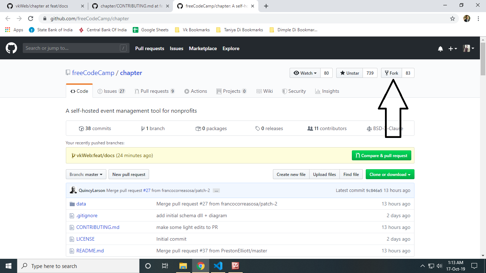

# Contribution Guidelines

Hello. :wave:

Welcome to Chapter, the newest project by freeCodeCamp. We are glad to see your interest in this project.

We strictly enforce our ["Code of Conduct"](https://www.freecodecamp.org/code-of-conduct). Please take a moment to read it. It's only 196 words long.

You should [join our Discord server](https://discord.gg/PXqYtEh) to get connected with people interested in this project and to be aware of our future announcements. 

## Here are some ways to help us

### 1. Take part in discussions and tell us your views

Implementation details are still being discussed and the project is currently at a very early stage. The stage of the project is changing on a daily basis, thoughts and ideas are being contributed at a very high pace.

Keep in mind that our focused discussions take place within GitHub [Issues](https://github.com/freeCodeCamp/chapter/issues) and [Pull Requests](https://github.com/freeCodeCamp/chapter/pulls).

Before opening a new issue, please search through current issues to verify that you are not creating a duplicate issue.

If you can't find what you were looking for then [open a new issue](https://github.com/freeCodeCamp/chapter/issues/new/choose) to share your views or to report bugs. 

For new "user stories" please do the following:

1. Check your idea does not already exist as an [MVP issue](https://github.com/freeCodeCamp/chapter/labels/MVP), or in the [post-MVP list](https://github.com/freeCodeCamp/chapter/issues/84).
1. [Create a new "Issue"](https://github.com/freeCodeCamp/chapter/issues/new/choose) and post details about the suggested user story.

### 2. Contribute to this open source codebase

If you feel ready to contribute code to this project then you should follow the below steps:

#### Step 1: Fork the repository on GitHub

['Forking'](https://help.github.com/articles/about-forks/) is a step where you get your own copy of Chapter's repository (a.k.a repo) on GitHub.

This is essential as it allows you to work on your own copy of Chapter. It allows you to request changes to be pulled into the Chapter's repository from your fork via a pull request.

Follow these steps to fork the `https://github.com/freeCodeCamp/chapter` repository:
1. Go to the Chapter repository on GitHub: <https://github.com/freeCodeCamp/chapter>.
2. Click the "Fork" Button in the upper right-hand corner of the interface ([Need help?](https://help.github.com/articles/fork-a-repo/)).
3. After the repository has been forked, you will be taken to your copy of the Chapter repository at `https://github.com/YOUR_USER_NAME/chapter`.



#### Step 2: Preparing the development environment

Install [Git](https://git-scm.com/) and a code editor of your choice. We recommend using [VS Code](https://code.visualstudio.com/). 

Clone your copy of Chapter. ['Cloning'](https://help.github.com/articles/cloning-a-repository/) is where you download a copy of the repository from a `remote` location to your local machine. Run these commands on your local machine to clone the repository:

1. Open a Terminal in a directory where you would like the Chapter project to reside.

2. Clone your fork of Chapter, make sure you replace `YOUR_USER_NAME` with your GitHub username:

    ```sh
    git clone https://github.com/YOUR_USER_NAME/Chapter.git
    ```

This will download the entire Chapter repository to your directory.

Now that you have downloaded a copy of your fork, you will need to set up an `upstream`. The main repository at `https://github.com/freeCodeCamp/chapter` is often referred to as the `upstream` repository. Your fork at `https://github.com/YOUR_USER_NAME/chapter` is often referred to as the `origin` repository.

You need a reference from your local copy to the `upstream` repository in addition to the `origin` repository. This is so that you can sync changes from the `upstream` repository to your fork which is called `origin`. To do that follow the below commands:

1. Change directory to the new chapter directory:

    ```sh
    cd chapter
    ```

2. Add a remote reference to the main chapter repository:

    ```sh
    git remote add upstream https://github.com/freeCodeCamp/chapter.git
    ```

3. Ensure the configuration looks correct:

    ```sh
    git remote -v
    ```

    The output should look something like below:
    ```sh
    origin    https://github.com/YOUR_USER_NAME/chapter.git (fetch)
    origin    https://github.com/YOUR_USER_NAME/chapter.git (push)
    upstream    https://github.com/freeCodeCamp/chapter.git (fetch)
    upstream    https://github.com/freeCodeCamp/chapter.git (push)
    ```

#### Step 3: Making changes to Chapter codebase :fire:

> **Note: Always follow the below steps before you start coding or working on an issue.**

You are now almost ready to make changes to files but before that you should **always** follow these steps:

1. Validate that you are on the `master` branch

    ```sh
    git status
    ```

    You should get an output like this:
    ```sh
    On branch master
    Your branch is up-to-date with 'origin/master'.

    nothing to commit, working directory clean
    ```

    If you are not on master or your working directory is not clean, resolve any outstanding files/commits and checkout `master`:
    ```sh
    git checkout master
    ```

2. Sync the latest changes from the chapter upstream `master` branch to your local master branch. This is very important to avoid conflicts later.

    > **Note:** If you have any outstanding Pull Request that you made from the `master` branch of your fork, you will lose them at the end of this step. You should ensure your pull request is merged by a moderator before performing this step. To avoid this scenario, you should *always* work on a branch separate from master.

    This step **will sync the latest changes** from the main repository of chapter. 

    Update your local copy of the freeCodeCamp upstream repository:
    ```sh
    git fetch upstream
    ```

    Hard reset your master branch with the chapter master:
    ```sh
    git reset --hard upstream/master
    ```

    Push your master branch to your origin to have a clean history on your fork on GitHub:
    ```sh
    git push origin master --force
    ```

    You can validate if your current master matches the upstream/master or not by performing a diff:
    ```sh
    git diff upstream/master
    ```

    If you don't get any output, you are good to go to the next step.

3. Create a fresh new branch

    Working on a separate branch for each issue helps you keep your local work copy clean. You should never work on the `master` branch. This will soil your copy of chapter and you may have to start over with a fresh clone or fork.

    Check that you are on `master` as explained previously, and branch off from there by typing:
    ```sh
    git checkout -b fix/update-readme
    ```

    Your branch name should start with `fix/`, `feat/`, `docs/`, etc. Avoid using issue numbers in branches. Keep them short, meaningful and unique.

    Some examples of good branch names are:
    ```md
    fix/update-nav-links
    fix/sign-in
    docs/typo-in-readme
    feat/sponsors
    ```

4. Edit files and write code on your favorite editor. Then check and confirm the files you are updating:

    ```sh
    git status
    ```

    This should show a list of `unstaged` files that you have edited.
    ```sh
    On branch feat/documentation
    Your branch is up to date with 'upstream/feat/documentation'.

    Changes not staged for commit:
    (use "git add/rm <file>..." to update what will be committed)
    (use "git checkout -- <file>..." to discard changes in working directory)

        modified:   CONTRIBUTING.md
        modified:   README.md
    ...
    ```

5. Stage the changes and make a commit

    In this step, you should only mark files that you have edited or added yourself. You can perform a reset and resolve files that you did not intend to change if needed.

    ```sh
    git add path/to/my/changed/file.ext
    ```

    Or you can add all the `unstaged` files to the staging area using the below handy command:

    ```sh
    git add .
    ```

    Only the files that were moved to the staging area will be added when you make a commit.

    ```sh
    git status
    ```

    Output:
    ```sh
    On branch feat/documentation
    Your branch is up to date with 'upstream/feat/documentation'.

    Changes to be committed:
    (use "git reset HEAD <file>..." to unstage)

        modified:   CONTRIBUTING.md
        modified:   README.md
    ```

    Now, you can commit your changes with a short message like so:

    ```sh
    git commit -m "fix: my short commit message"
    ```

    We highly recommend making a conventional commit message. This is a good practice that you will see on some of the popular Open Source repositories. As a developer, this encourages you to follow standard practices.

    Some examples of conventional commit messages are:

    ```md
    fix: update API routes
    feat: RSVP event
    fix(docs): update database schema image
    ```
    Keep your commit messages short. You can always add additional information in the description of the commit message.

6. Next, you can push your changes to your fork.

    ```sh
    git push origin branch-name-here
    ```

    For example if the name of your branch is `fix/signin` then your command should be:
    ```sh
    git push origin fix/signin
    ```

#### Step 4: Proposing a Pull Request (PR)

After you've committed and pushed changes to your fork, check here for [how to open a Pull Request](/docs/how-to-open-a-pull-request.md).

## Frequently Asked Questions

### What do we need help with right now?

We are in the very early stages of development on this new application. We value your insight and expertise.  In order to prevent duplicate issues, please search through our existing issues to see if there is one for which you would like to provide feedback. We are currently trying to consolidate many of the issues based on topics like documentation, user interface, API endpoints, and architecture. Please [join our Discord server](https://discord.gg/PXqYtEh) to stay in the loop.

### I found a typo. Should I report an issue before I can make a pull request?

For typos and other wording changes, you can directly open pull requests without first creating an issue. Issues are more for discussing larger problems associated with code or structural aspects of the application.

### I am new to GitHub and Open Source, where should I start?

Read our [How to Contribute to Open Source Guide](https://github.com/freeCodeCamp/how-to-contribute-to-open-source).

We are excited to help you contribute to any of the topics that you would like to work on. Feel free to ask us questions on the related issue threads, and we will be glad to clarify. Make sure you search for your query before posting a new one. Be polite and patient. Our community of volunteers and moderators are always around to guide you through your queries.

When in doubt, you can reach out to current project lead(s):

| Name            | GitHub | Twitter |
|:----------------|:-------|:--------|
| Quincy Larson | [`@QuincyLarson`](https://github.com/QuincyLarson) | [`@ossia`](https://twitter.com/ossia)|

You are a champion :).
