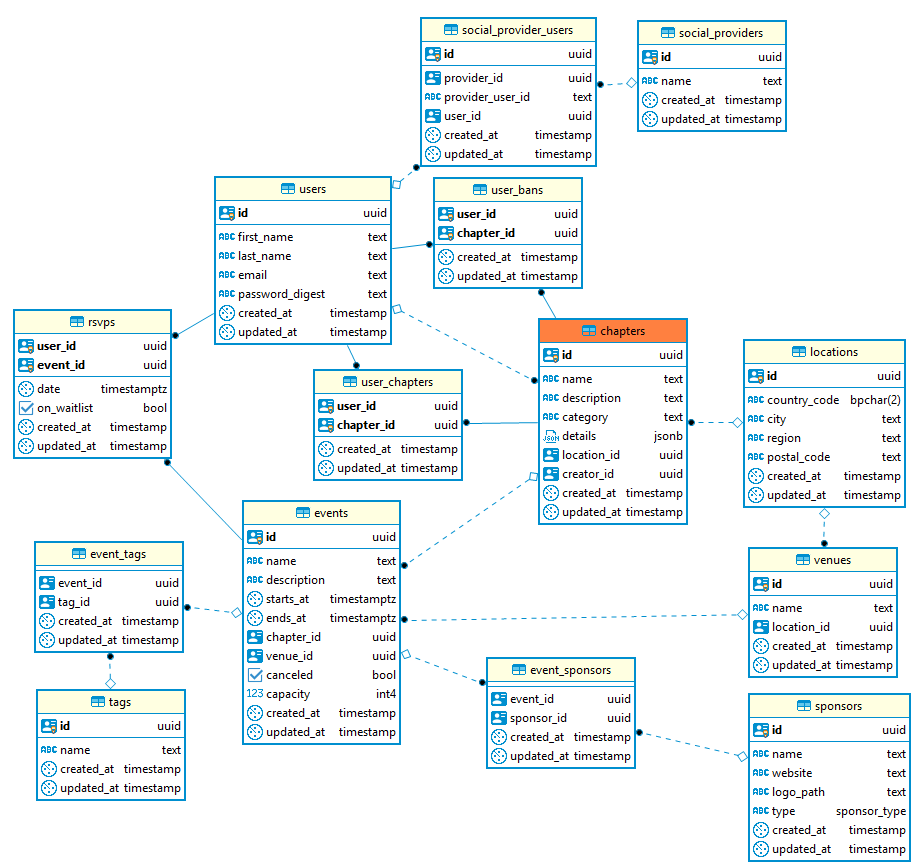

# Contribution Guidelines

Hello. :wave:

Welcome to Chapter, the newest project by freeCodeCamp. We are glad to see your interest in this project.

We strictly enforce our ["Code of Conduct"](https://www.freecodecamp.org/code-of-conduct). Please take a moment to read it. It's only 196 words long.

You should [join our Discord server](https://discord.gg/PXqYtEh) to get connected with people interested in this project and to be aware of our future announcements.

## Contribute code

If you are willing to contribute code to this project then you should follow the below steps:

<details><summary>Step 1: Fork the repository on GitHub</summary>

['Forking'](https://help.github.com/articles/about-forks/) is a step where you get your own copy of Chapter's repository (a.k.a repo) on GitHub.

This is essential as it allows you to work on your own copy of Chapter. It allows you to request changes to be pulled into the Chapter's repository from your fork via a pull request.

Follow these steps to fork the `https://github.com/freeCodeCamp/chapter` repository:
1. Go to the Chapter repository on GitHub: <https://github.com/freeCodeCamp/chapter>.
2. Click the "Fork" Button in the upper right-hand corner of the interface ([Need help?](https://help.github.com/articles/fork-a-repo/)).
3. After the repository has been forked, you will be taken to your copy of the Chapter repository at `https://github.com/YOUR_USER_NAME/chapter`.


</details>
<details><summary>Step 2: Preparing the development environment</summary>

Install [Git](https://git-scm.com/) and a code editor of your choice. We recommend using [VS Code](https://code.visualstudio.com/).

Clone your copy of Chapter. ['Cloning'](https://help.github.com/articles/cloning-a-repository/) is where you download a copy of the repository from a `remote` location to your local machine. Run these commands on your local machine to clone the repository:

1. Open a Terminal in a directory where you would like the Chapter project to reside.

2. Clone your fork of Chapter, make sure you replace `YOUR_USER_NAME` with your GitHub username:

    ```sh
    git clone https://github.com/YOUR_USER_NAME/Chapter.git
    ```

This will download the entire Chapter repository to your directory.

Now that you have downloaded a copy of your fork, you will need to set up an `upstream`. The main repository at `https://github.com/freeCodeCamp/chapter` is often referred to as the `upstream` repository. Your fork at `https://github.com/YOUR_USER_NAME/chapter` is often referred to as the `origin` repository.

You need a reference from your local copy to the `upstream` repository in addition to the `origin` repository. This is so that you can sync changes from the `upstream` repository to your fork which is called `origin`. To do that follow the below commands:

1. Change directory to the new chapter directory:

    ```sh
    cd chapter
    ```

2. Add a remote reference to the main chapter repository:

    ```sh
    git remote add upstream https://github.com/freeCodeCamp/chapter.git
    ```

3. Ensure the configuration looks correct:

    ```sh
    git remote -v
    ```

    The output should look something like below:
    ```sh
    origin    https://github.com/YOUR_USER_NAME/chapter.git (fetch)
    origin    https://github.com/YOUR_USER_NAME/chapter.git (push)
    upstream    https://github.com/freeCodeCamp/chapter.git (fetch)
    upstream    https://github.com/freeCodeCamp/chapter.git (push)
    ```

</details>

<details><summary>Step 3: Running Chapter locally</summary>

You will need Node.js for your operating system. So download and install Node.js from the [official Node.js website](https://nodejs.org/en/download/).

Ensure you are installing Node.js 13 or greater and npm 6 or greater by using:
```
node --version
v14.13.1

npm --version
6.14.8
```

Then install the dependencies using:
```
npx recursive-install
```

There are two approaches to running Chapter locally. First by using Docker and second by setting up client-server, db, api-server all by yourself. Let's see the Docker method first then we'll see a more hands-on method. 

**First method: using Docker**

See the [Docker installation "Supported platforms"](https://docs.docker.com/install/#supported-platforms) section and follow the instructions to download & install Docker Desktop for your operating system (or Docker CE for Linux).

You can find more resources on Docker here:
- [Docker: What and Why](https://stackoverflow.com/questions/28089344/docker-what-is-it-and-what-is-the-purpose)
- [Docker Lessons on KataCoda](https://www.katacoda.com/learn?q=docker)
- [Play with Docker Classroom](https://training.play-with-docker.com/)


Ensure that Docker Desktop is up and running, then run the following command:
```
docker-compose up
```

Wait for the logs to show "server started on port 8000", then navigate to `localhost:8000` to view the app.

The server will automatically restart anytime you save a `.ts` or `.js` file within the `server/` directory.

You can run any command within the container by prefixing it with `docker-compose exec app`, e.g. `docker-compose exec app npm install express`

Initially the DB will be empty. Now, to seed it with sample data, run `yarn db:reset`.

**Note for existing contributors:** If you (or someone else via a commit) updates `Dockerfile` or the contents of its build directory, run `docker-compose build` to get the new image. And then run `docker-compose up` to start the container's services. 

**Second method: manually managing the client-server, db, api-server**

This is a lot lighter setup, but you need to provide your own Postgres DB. If you don't want to run one locally you can get it as a service on [ElephantSQL](https://www.elephantsql.com/).

[Download and Install PostgreSQL](https://www.postgresql.org/download/). Then create a database, add the DB name and credentials to `.env`. If using remote database change `DB_URL` in `.env` to the URL provided by your remote database provider.

Make sure to set `IS_DOCKER=` in `.env` to blank. Then run the below command to start the api-server and client-server:

```
npm run both
```

Initially the DB will be empty. Now, to seed it with sample data, run `yarn db:reset`.
</details>

<details><summary>Step 4: Making changes to Chapter codebase and Testing code :fire:</summary>

> **Note: Always follow the below steps before you start coding or working on an issue.**

You are now almost ready to make changes to files but before that you should **always** follow these steps:

1. Validate that you are on the `master` branch

    ```sh
    git status
    ```

    You should get an output like this:
    ```sh
    On branch master
    Your branch is up-to-date with 'origin/master'.

    nothing to commit, working directory clean
    ```

    If you are not on master or your working directory is not clean, resolve any outstanding files/commits and checkout `master`:
    ```sh
    git checkout master
    ```

2. Sync the latest changes from the chapter upstream `master` branch to your local master branch. This is very important to avoid conflicts later.

    > **Note:** If you have any outstanding Pull Request that you made from the `master` branch of your fork, you will lose them at the end of this step. You should ensure your pull request is merged by a moderator before performing this step. To avoid this scenario, you should *always* work on a branch separate from master.

    This step **will sync the latest changes** from the main repository of chapter.

    Update your local copy of the freeCodeCamp upstream repository:
    ```sh
    git fetch upstream
    ```

    Hard reset your master branch with the chapter master:
    ```sh
    git reset --hard upstream/master
    ```

    Push your master branch to your origin to have a clean history on your fork on GitHub:
    ```sh
    git push origin master --force
    ```

    You can validate if your current master matches the upstream/master or not by performing a diff:
    ```sh
    git diff upstream/master
    ```

    If you don't get any output, you are good to go to the next step.

3. Create a fresh new branch

    Working on a separate branch for each issue helps you keep your local work copy clean. You should never work on the `master` branch. This will soil your copy of chapter and you may have to start over with a fresh clone or fork.

    Check that you are on `master` as explained previously, and branch off from there by typing:
    ```sh
    git checkout -b fix/update-readme
    ```

    Your branch name should start with `fix/`, `feat/`, `docs/`, etc. Avoid using issue numbers in branches. Keep them short, meaningful and unique.

    Some examples of good branch names are:
    ```md
    fix/update-nav-links
    fix/sign-in
    docs/typo-in-readme
    feat/sponsors
    ```

4. Edit files and write code on your favorite editor. Then check and confirm the files you are updating:

    ```sh
    git status
    ```

    This should show a list of `unstaged` files that you have edited.
    ```sh
    On branch feat/documentation
    Your branch is up to date with 'upstream/feat/documentation'.

    Changes not staged for commit:
    (use "git add/rm <file>..." to update what will be committed)
    (use "git checkout -- <file>..." to discard changes in working directory)

        modified:   CONTRIBUTING.md
        modified:   README.md
    ...
    ```

5. Test your code **Always!** 

If you have done manual server setup that is without Docker then run tests using:
```
npm run test
```

If you used Docker then suffix the command with `docker-compose exec`. Something like this:

```
NODE_ENV=test docker-compose exec app npm run test
```

You can run tests in watch mode by running:
```
npm run test:watch
```

6. Stage the changes and make a commit

    In this step, you should only mark files that you have edited or added yourself. You can perform a reset and resolve files that you did not intend to change if needed.

    ```sh
    git add path/to/my/changed/file.ext
    ```

    Or you can add all the `unstaged` files to the staging area using the below handy command:

    ```sh
    git add .
    ```

    Only the files that were moved to the staging area will be added when you make a commit.

    ```sh
    git status
    ```

    Output:
    ```sh
    On branch feat/documentation
    Your branch is up to date with 'upstream/feat/documentation'.

    Changes to be committed:
    (use "git reset HEAD <file>..." to unstage)

        modified:   CONTRIBUTING.md
        modified:   README.md
    ```

    Now, you can commit your changes with a short message like so:

    ```sh
    git commit -m "fix: my short commit message"
    ```

    We highly recommend making a conventional commit message. This is a good practice that you will see on some of the popular Open Source repositories. As a developer, this encourages you to follow standard practices.

    Some examples of conventional commit messages are:

    ```md
    fix: update API routes
    feat: RSVP event
    fix(docs): update database schema image
    ```
    Keep your commit messages short. You can always add additional information in the description of the commit message.

7. Next, you can push your changes to your fork.

    ```sh
    git push origin branch-name-here
    ```

    For example if the name of your branch is `fix/signin` then your command should be:
    ```sh
    git push origin fix/signin
    ```
</details>

<details><summary>Step 5: Proposing a Pull Request (PR)</summary>

#### How to prepare a good Pull Request title:

When opening a Pull Request(PR), use the following scope table to decide what to title your PR in the following format:

`fix/feat/chore/refactor/docs/perf (scope): PR Title`

An example is `feat(client): night mode`.

| Scope | Documentation |
|---|---|
| `api` | For Pull Requests making changes to the APIs, routes and its architecture |
| `db` | For Pull Requests making changes related to database |
| `client` | For Pull Requests making changes to client platform logic or user interface |
| `docs` | For Pull Requests making changes to the project's documentation |

#### Proposing a Pull Request (PR)

1. Once the edits have been committed & pushed, you will be prompted to create a pull request on your fork's GitHub Page. Click on `Compare and Pull Request`.

    

2. By default, all pull requests should be against the Chapter main repo, `master` branch.

    

3. Submit the pull request from your branch to Chapter's `master` branch.

4. In the body of your PR include a more detailed summary of the changes you made and why.

    - You will be presented with a pull request template. This is a checklist that you should have followed before opening the pull request.

    - Fill in the details as they seem fit to you. This information will be reviewed and a decision will be made whether or not your pull request is going to be accepted.

    - If the PR is meant to fix an existing bug/issue then, at the end of
      your PR's description, append the keyword `closes` and #xxxx (where xxxx
      is the issue number). Example: `closes #1337`. This tells GitHub to
      automatically close the existing issue, if the PR is accepted and merged.

You have successfully created a PR. Congratulations! :tada:
</details>

## Frequently Asked Questions

### What do we need help with right now?

We are in the very early stages of development on this new application. We value your insight and expertise.  In order to prevent duplicate issues, please search through our existing issues to see if there is one for which you would like to provide feedback. We are currently trying to consolidate many of the issues based on topics like documentation, user interface, API endpoints, and architecture. Please [join our Discord server](https://discord.gg/PXqYtEh) to stay in the loop.

### I found a typo. Should I report an issue before I can make a pull request?

For typos and other wording changes, you can directly open pull requests without first creating an issue. Issues are more for discussing larger problems associated with code or structural aspects of the application.

### I am new to GitHub and Open Source, where should I start?

Read our [How to Contribute to Open Source Guide](https://github.com/freeCodeCamp/how-to-contribute-to-open-source).

We are excited to help you contribute to any of the topics that you would like to work on. Feel free to ask us questions on the related issue threads, and we will be glad to clarify. Make sure you search for your query before posting a new one. Be polite and patient. Our community of volunteers and moderators are always around to guide you through your queries.

When in doubt, you can reach out to current project lead(s):

| Name            | GitHub | Role |
|:----------------|:-------|:-----|
| Fran Zeko | [@Zeko369](https://github.com/Zeko369) | Admin UI, routes, models, and data migrations
| Ayotomide Oladipo | [@tomiiide](https://github.com/tomiiide) | Public-facing client pages / forms
| Timmy Chen | [@timmyichen](https://github.com/timmyichen) | API
| Patrick San Juan | [@pdotsani](https://github.com/pdotsani) | Google Authentication
| Jonathan Seubert | [@megajon](https://github.com/megajon) | Email
| Vaibhav Singh | [@vaibhavsingh97](https://github.com/vaibhavsingh97) | Heroku 1-click deployment
| Jim Ciallella | [@allella](https://github.com/allella) | Documentation
| Quincy Larson | [@QuincyLarson](https://github.com/QuincyLarson) | Executive Lead

You are a champion :).

# Server-side Technical Documentation

## API Specification

We use [Open API 3.0](https://www.openapis.org/about) to define the API structure of the application.

You can see our full API documentation by navigating to http://localhost:8000/api/v1/docs.

## Database

for any problems ping [@Zeko369 on github](https://github.com/Zeko369) or discord (Zeko369#6685)

<details>
<summary>Expand to view a diagram illustrating the proposed schema for Chapter.</summary>
<br>


> created with [DBeaver.io](https://dbeaver.com/docs/wiki/ER-Diagrams/)
</details>

We're using Postgres for our database and TypeORM for our ORM (mapping database tables to js objects). Here are a few examples on how to use our TypeORM setup.

To make it since the port from docker `postgres` service is exposed to the host (54320, not to mess with local `postgres` if you're running one) you don't have to run `docker-compose exec...`, and can just run db commands from the host. This also makes it a lot easier to access the db from the outside if you're not running a local db on the system to for example open it in [Postico](https://eggerapps.at/postico/) / [Table Plus](https://tableplus.com/).
Our DB commands closely mirror their rails counterparts (there isn't anything quite similar to ActiveRecord and RailsCLI in node yet, so till then #rails 🚋 )

`yarn db:generate NAME` -> `rake db:generate NAME`, note that this command checks for the diff between models and db, unlike rails where you need to specify the migration by hand
`yarn db:migrate` -> `rake db:migrate`
`yarn db:seed` -> `rake db:seed`
`yarn db:reset` -> `rake db:reset`

### Seed Database

`yarn db:seed`

Development is easier with a database full of example entities. The process of creating example entities in the database is called seeding.

Use `yarn db:seed` to create these example entities. But first (if the you're just starting) you need to migrate the DB (setup tables). For that you can use `yarn db:reset` which will drop the current db (clear), migrate it (add structure) and then seed it (add data)

### Create a New Model / Entity

`npm run typeorm entity:create -- --name=ModelName`

This would create `ModelName.ts` in `server/models`

To keep everything DRY, add `extends BaseModel` to the class and import it from 'server/models/BaseModel' to no repeat id, createdAt, and updatedAt fields on every single model

You could also run `npx typeorm` since here you're not actually loading any ts files, but because regular `npx typeorm` runs inside of node it import from `.ts` files, so we run it with `ts-node` and our custom server config (check package.json)

### Create a Migration

After you created a new model or updated an existing one, you need to generate a migration for those changes. To do so run:

`yarn db:generate MIGRATION_NAME`

Since this runs a compare agains the current db schema, you need to have the DB running (If you're using docker-compose, you need to have that running).

After that, check the generated SQL in `db/migrations/date-MigrationName.ts`

### Running migrations and checking if migrations were run

You can manualy run them by doing
`yarn db:migrate`

and then check if it happened correctly

`yarn typeorm migration:show`

it should ouput something like

```
 [X] Chapter1574341690449
 ...
 [X] MigrationName1575633316367
```
