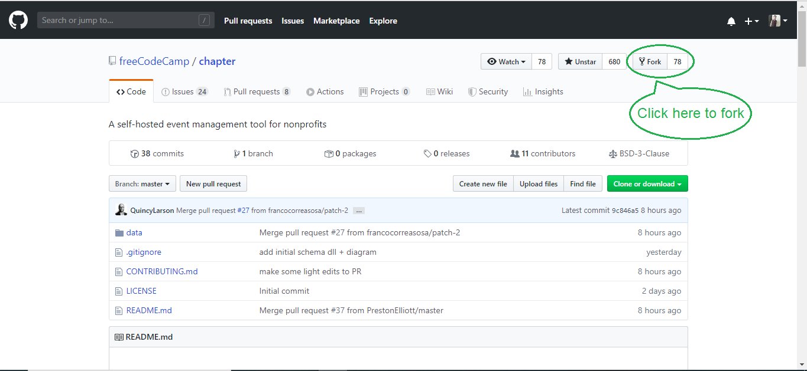

# Contribution Guidelines

Hello. 👋

Welcome to Chapter, the newest project by freeCodeCamp. We are glad to see your interest in this project.

We strictly enforce our ["Code of Conduct"](https://www.freecodecamp.org/code-of-conduct). Please take a moment to read it. It's only 196 words long.

## Here are some ways to help us
Implementation details are still being discussed and the project is currently at a very early stage. The stage of the project is changing on a daily basis, thoughts and ideas are being contributed at a very high pace.

### Contribute to this open source codebase
If you feel ready to contribute to this project then you should follow the below steps:

#### Step 1: Fork the repository on GitHub
['Forking'](https://help.github.com/articles/about-forks/) is a step where you get your own copy of Chapter's repository (a.k.a _repo_) on GitHub.

This is essential as it allows you to work on your own copy of Chapter. It allows you to request changes to be pulled into the Chapter's repository from your fork via a pull request.

Follow these steps to fork the `https://github.com/freeCodeCamp/Chapter` repository:
1. Go to the Chapter repository on GitHub: <https://github.com/freeCodeCamp/Chapter>.
2. Click the "Fork" Button in the upper right-hand corner of the interface ([More Details Here](https://help.github.com/articles/fork-a-repo/)).
3. After the repository has been forked, you will be taken to your copy of the Chapter repository at `https://github.com/YOUR_USER_NAME/Chapter`.



#### Step 2: Preparing the development environment

Install [Git](https://git-scm.com/) and a code editor of your choice. We recommend using [VS Code](https://code.visualstudio.com/). 

Then clone your copy of Chapter. ['Cloning'](https://help.github.com/articles/cloning-a-repository/) is where you **download** a copy of the repository from a `remote` location to your local machine.

Run these commands on your local machine to clone the repository:

1. Open a Terminal in a directory where you would like the Chapter project to reside.

2. Clone your fork of Chapter, replacing `YOUR_USER_NAME` with your GitHub Username:

    ```sh
    git clone https://github.com/YOUR_USER_NAME/Chapter.git
    ```

This will download the entire Chapter repository to your directory.

Now that you have downloaded a copy of your fork, you will need to set up an `upstream`.

The main repository at `https://github.com/freeCodeCamp/Chapter` is often referred to as the `upstream` repository. Your fork at `https://github.com/YOUR_USER_NAME/Chapter` is often referred to as the `origin` repository.

You need a reference from your local clone to the `upstream` repository in addition to the `origin` repository. This is so that you can sync changes from the main repository to your fork.

1. Change directory to the new Chapter directory:

    ```sh
    cd Chapter
    ```

2. Add a remote reference to the main Chapter repository:

    ```sh
    git remote add upstream https://github.com/freeCodeCamp/Chapter.git
    ```

3. Ensure the configuration looks correct:

    ```sh
    git remote -v
    ```

    The output should look something like below:

    ```sh
    origin    https://github.com/YOUR_USER_NAME/Chapter.git (fetch)
    origin    https://github.com/YOUR_USER_NAME/Chapter.git (push)
    upstream    https://github.com/freeCodeCamp/Chapter.git (fetch)
    upstream    https://github.com/freeCodeCamp/Chapter.git (push)
    ```

#### Step 3: Making changes to Chapter

You are now almost ready to make changes to files but before that you should follow these steps:

1. Validate that you are on the `master` branch

    ```sh
    git status
    ```

    You should get an output like this:

    ```sh
    On branch master
    Your branch is up-to-date with 'origin/master'.

    nothing to commit, working directory clean
    ```

    If you are not on master or your working directory is not clean, resolve any outstanding files/commits and checkout `master`:

    ```sh
    git checkout master
    ```

2. Sync the latest changes from the Chapter upstream `master` branch to your local master branch.

    **Note:** If you have any outstanding Pull Request that you made from the `master` branch of your fork, you will lose them at the end of this step. You should ensure your pull request is merged by a moderator before performing this step. To avoid this scenario, you should *always* work on a branch separate from master.

    This step **will sync the latest changes** from the main repository of Chapter. This is very important to avoid conflicts later.

    Update your local copy of the freeCodeCamp upstream repository:
    ```sh
    git fetch upstream
    ```

    Hard reset your master branch with the Chapter master:
    ```sh
    git reset --hard upstream/master
    ```

    Push your master branch to your origin to have a clean history on your fork on GitHub:
    ```sh
    git push origin master --force
    ```

    You can validate your current master matches the upstream/master by performing a diff:
    ```sh
    git diff upstream/master
    ```

    If you don't get any output, you are good to go.

3. Create a fresh new branch

    Working on a separate branch for each issue helps you keep your local work copy clean. You should never work on the `master`. This will soil your copy of Chapter and you may have to start over with a fresh clone or fork.

    Check that you are on `master` as explained previously, and branch off from there:

    ```sh
    git checkout -b fix/update-readme
    ```

    Your branch name should start with a `fix/`, `feat/`, `docs/`, etc. Avoid using issue numbers in branches. Keep them short, meaningful and unique.

    Some examples of good branch names are:

    ```md
    fix/update-nav-links
    fix/sign-in
    fix/typo-in-readme
    feat/sponsors
    ```

4. Edit files and write code on your favorite editor. Then check and confirm the files you are updating:
    ```sh
    git status
    ```

    This should show a list of `unstaged` files that you have edited.
    ```sh
    On branch feat/documentation
    Your branch is up to date with 'upstream/feat/documentation'.

    Changes not staged for commit:
    (use "git add/rm <file>..." to update what will be committed)
    (use "git checkout -- <file>..." to discard changes in working directory)

        modified:   CONTRIBUTING.md
        modified:   README.md
    ...
    ```

5. Stage the changes and make a commit

    In this step, you should only mark files that you have edited or added yourself. You can perform a reset and resolve files that you did not intend to change if needed.

    ```sh
    git add path/to/my/changed/file.ext
    ```

    Or you can add all the `unstaged` files to the staging area using the below handy command:

    ```sh
    git add .
    ```

    Only the files that were moved to the staging area will be added when you make a commit.

    ```sh
    git status
    ```

    Output:
    ```sh
    On branch feat/documentation
    Your branch is up to date with 'upstream/feat/documentation'.

    Changes to be committed:
    (use "git reset HEAD <file>..." to unstage)

        modified:   CONTRIBUTING.md
        modified:   README.md
    ```

    Now, you can commit your changes with a short message like so:

    ```sh
    git commit -m "fix: my short commit message"
    ```

    Some examples:

    ```md
    fix: update API routes
    feat: enable RSVP
    ```

    We highly recommend making a conventional commit message. This is a good practice that you will see on some of the popular Open Source repositories. As a developer, this encourages you to follow standard practices.

    Some examples of conventional commit messages are:

    ```md
    fix: update HTML guide article
    fix: update build scripts for Travis-CI
    feat: add article for JavaScript hoisting
    docs: update contributing guidelines
    ```

    Keep these short, not more than 50 characters. You can always add additional information in the description of the commit message.

    This does not take any additional time than an unconventional message like 'update file' or 'add index.md'

    You can learn more about why you should use conventional commits [here](https://www.conventionalcommits.org/en/v1.0.0-beta.2/#why-use-conventional-commits).

6. If you realise that you need to edit a file or update the commit message after making a commit you can do so after editing the files with:

    ```sh
    git commit --amend
    ```

    This will open up a default text editor like `nano` or `vi` where you can edit the commit message title and add/edit the description.

7. Next, you can push your changes to your fork.

    ```sh
    git push origin branch/name-here
    ```

#### Proposing a Pull Request (PR)
After you've committed your changes, check here for [how to open a Pull Request](/docs/how-to-open-a-pull-request.md).

### Share your ideas and thoughts with us
