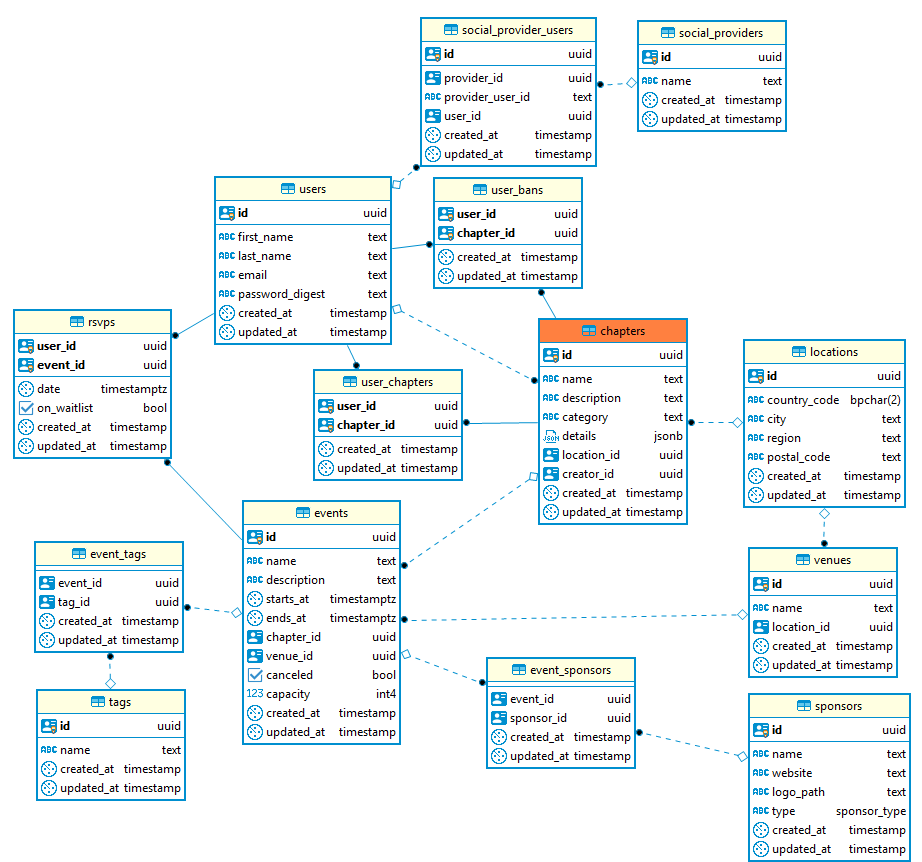

# Welcome to Chapter
[](#contributors)

After several years of being dissatisfied with existing group event tools (Meetup, Facebook events) we decided to build our own.

This will be a self-hosted Docker container that you can one-click deploy to the cloud, then configure through an admin panel. No coding required.

Your nonprofit can sub-domain it to your website like `chapter.sierraclub.org` or `chapter.womenwhocode.org`.

You can use your own authentication tools. And all your user data will stay on your own server.

### API Specification

We use [Open API 3.0](https://www.openapis.org/about) to define the API structure of the application. You can see the full documentation with:

```bash
npm run speccy
```
Navigate to http://localhost:8001 to see API docs

## Terminology
To better communicate and more easily build an API and UI, we've decided on a collection of terminology to discuss about the Chapter project in a clear way:

- `organization` is a singular instance/deployment of Chapter. Example: Women Who Code at the domain `chapter.womenwhocode.org`.
- `chapter` is a container for events, with a description and subscribers, and one or more admins who can manage it. Example: Women Who Code NYC.
- `event` is a single meetup that users can RSVP to, has a specific location and time, and has organizers. Example: Women Who Code NYC - April 2019 Event.
- `user` is a person who belongs to a chapter.

## Tech Stack

We are planning to use the following tools:

* [Node.js](https://nodejs.org) / [Express](https://expressjs.com) for our backend using JavaScript/TypeScript
* [Postgres](https://www.postgresql.org) with [Sequelize ORM](https://sequelize.org)
* [Next.js](https://nextjs.org/) for both client and server-side rendering of the frontend (NextJS is based on [React](https://reactjs.org))
  * [JavaScript/TypeScript](https://www.typescriptlang.org/index.html#download-links)
  * [Styled Components](https://www.styled-components.com) for styling.
  * Functional Components with [Hooks](https://reactjs.org/docs/hooks-intro.html)


A lot of people know these tools, and they're proven to work well at scale.

We will focus on building an open API first. Then developers can use the API to build their own mobile clients and voice interface clients.

## Development Setup

Requirements: Node.js, Docker, internet access

### Installing Node.js

Follow instructions for downloading and installing Node.js for your operating system from the [official Node.js website](https://nodejs.org/en/download/).

Ensure you are installing Node 10 or greater and npm 6 or greater.

### Installing Docker

See the [Docker installation "Supported platforms"](https://docs.docker.com/install/#supported-platforms) section and follow the instructions to download & install Docker Desktop for your operating system (or Docker CE for Linux).

You can find more resources on Docker here:
- [Docker: What and Why](https://stackoverflow.com/questions/28089344/docker-what-is-it-and-what-is-the-purpose)
- [Docker Lessons on KataCoda](https://www.katacoda.com/learn?q=docker)
- [Play with Docker Classroom](https://training.play-with-docker.com/)

### Starting the Development Server

Open up Terminal/Powershell/bash and navigate to the directory where you want the project to live.

Clone this repository:
```
git clone https://github.com/freeCodeCamp/chapter
```

Navigate to the newly cloned repo:
```
cd chapter
```

Install dependencies:
```
npm install
```

Ensure that Docker Desktop is up and running, then run the following command:
```
docker-compose up
```

Wait for the logs to show "server started on port 8000", then navigate to `localhost:8000` to view the app.

The server will automatically restart anytime you save a `.ts` or `.js` file within the `server/` directory.

You can run any command within the container by prefixing it with `docker-compose exec app`, e.g. `docker-compose exec app npm install express`

## Testing 
Run tests
```
npm run test
```

Run tests in watch mode
```
npm run test:watch
```

## Schema
<details>
<summary>Expand to view a diagram illustrating the proposed schema for Chapter.</summary>
<br>


</details>

## User Stories

### MVP
The [MVP user stories are shown in the MVP Project](https://github.com/freeCodeCamp/chapter/projects/1) kanban / cards and as [issues marked with "MVP"](https://github.com/freeCodeCamp/chapter/labels/MVP).

### Post-MVP
We are maintaining a list of [post-MVP user stories](https://github.com/freeCodeCamp/chapter/issues/84).

## Roadmap

The on-going [project Roadmap conversation](https://github.com/freeCodeCamp/chapter/issues/47) is regularly updated to reflect the overall progress and for higher-level discussions.

Quincy Larson is the project lead. [FreeCodeCamp](https://www.freecodecamp.org) will start "dogfooding" the MVP with several of its local study groups.

Here's an out-dated example of an app with similar functionality: [The freeCodeCamp Study Group Directory](https://study-group-directory.freecodecamp.org).


## Contributing

* You should [join our Discord server](https://discord.gg/PXqYtEh) to get connected with people interested in this project and to be aware of our future announcements.
* Please read the [**suggested steps to contribute code to the Chapter project**](CONTRIBUTING.md) before creating issues, forking, or submitting any pull requests.

## License

Copyright © 2019 freeCodeCamp.org

The computer software is licensed under the [BSD-3-Clause](LICENSE) license.

## Contributors ✨

Thanks goes to these wonderful people ([emoji key](https://allcontributors.org/docs/en/emoji-key)):

<!-- ALL-CONTRIBUTORS-LIST:START - Do not remove or modify this section -->
<!-- prettier-ignore -->
<table>
  <tr>
    <td align="center"><a href="https://www.freecodecamp.org"><br /><sub><b>Quincy Larson</b></sub></a><br /><a href="https://github.com/freeCodeCamp/chapter/commits?author=quincylarson" title="Code">💻</a> <a href="https://github.com/freeCodeCamp/chapter/commits?author=quincylarson" title="Documentation">📖</a> <a href="#ideas-quincylarson" title="Ideas, Planning, & Feedback">🤔</a></td>
    <td align="center"><a href="https://teachen.info"><br /><sub><b>Tim Chen</b></sub></a><br /><a href="https://github.com/freeCodeCamp/chapter/commits?author=timmyichen" title="Code">💻</a> <a href="#maintenance-timmyichen" title="Maintenance">🚧</a> <a href="#tool-timmyichen" title="Tools">🔧</a></td>
    <td align="center"><a href="https://github.com/nik-john"><br /><sub><b>nikjohn</b></sub></a><br /><a href="https://github.com/freeCodeCamp/chapter/commits?author=nik-john" title="Code">💻</a> <a href="https://github.com/freeCodeCamp/chapter/commits?author=nik-john" title="Documentation">📖</a> <a href="#tool-nik-john" title="Tools">🔧</a></td>
    <td align="center"><a href="https://turnintocoders.it"><br /><sub><b>Matteo Giaccone</b></sub></a><br /><a href="#platform-matjack1" title="Packaging/porting to new platform">📦</a> <a href="https://github.com/freeCodeCamp/chapter/commits?author=matjack1" title="Code">💻</a> <a href="https://github.com/freeCodeCamp/chapter/commits?author=matjack1" title="Documentation">📖</a></td>
    <td align="center"><a href="http://twitter.com/iansltx"><br /><sub><b>Ian Littman</b></sub></a><br /><a href="https://github.com/freeCodeCamp/chapter/commits?author=iansltx" title="Code">💻</a></td>
    <td align="center"><a href="https://github.com/raufabr"><br /><sub><b>Abrar Rauf</b></sub></a><br /><a href="https://github.com/freeCodeCamp/chapter/commits?author=raufabr" title="Documentation">📖</a></td>
    <td align="center"><a href="http://Sonicrida.com"><br /><sub><b>Jonathan Chhabra</b></sub></a><br /><a href="#maintenance-Sonicrida" title="Maintenance">🚧</a> <a href="https://github.com/freeCodeCamp/chapter/commits?author=Sonicrida" title="Code">💻</a></td>
  </tr>
  <tr>
    <td align="center"><a href="https://thomasroest.com"><br /><sub><b>Thomas Roest</b></sub></a><br /><a href="https://github.com/freeCodeCamp/chapter/commits?author=ThomasRoest" title="Code">💻</a></td>
    <td align="center"><a href="https://www.scottbrenner.me/"><br /><sub><b>Scott Brenner</b></sub></a><br /><a href="https://github.com/freeCodeCamp/chapter/commits?author=ScottBrenner" title="Documentation">📖</a></td>
    <td align="center"><a href="https://github.com/allella"><br /><sub><b>Jim Ciallella</b></sub></a><br /><a href="https://github.com/freeCodeCamp/chapter/commits?author=allella" title="Documentation">📖</a></td>
    <td align="center"><a href="http://www.pipelabs.com.au"><br /><sub><b>Joel Rozen</b></sub></a><br /><a href="https://github.com/freeCodeCamp/chapter/commits?author=joelrozen" title="Code">💻</a></td>
    <td align="center"><a href="https://github.com/yitzhak-bloy"><br /><sub><b>yitzhak-bloy</b></sub></a><br /><a href="https://github.com/freeCodeCamp/chapter/commits?author=yitzhak-bloy" title="Documentation">📖</a></td>
    <td align="center"><a href="https://github.com/eolculnamo2"><br /><sub><b>Rob Bertram</b></sub></a><br /><a href="https://github.com/freeCodeCamp/chapter/commits?author=eolculnamo2" title="Code">💻</a></td>
    <td align="center"><a href="https://github.com/Zeko369"><br /><sub><b>Fran Zekan</b></sub></a><br /><a href="https://github.com/freeCodeCamp/chapter/commits?author=Zeko369" title="Code">💻</a> <a href="#tool-Zeko369" title="Tools">🔧</a></td>
  </tr>
  <tr>
    <td align="center"><a href="https://www.linkedin.com/in/jesuloba-egunjobi-781183127"><br /><sub><b>Jesuloba Egunjobi</b></sub></a><br /><a href="#platform-Lobarr" title="Packaging/porting to new platform">📦</a></td>
    <td align="center"><a href="https://github.com/lakshmipriyamukundan"><br /><sub><b>Lakshmipriya</b></sub></a><br /><a href="https://github.com/freeCodeCamp/chapter/commits?author=lakshmipriyamukundan" title="Documentation">📖</a></td>
    <td align="center"><a href="https://github.com/rhvdbergh"><br /><sub><b>Ronald van der Bergh</b></sub></a><br /><a href="https://github.com/freeCodeCamp/chapter/commits?author=rhvdbergh" title="Documentation">📖</a></td>
    <td align="center"><a href="https://reinforcementlearning4.fun/"><br /><sub><b>Rodolfo Mendes</b></sub></a><br /><a href="https://github.com/freeCodeCamp/chapter/commits?author=rodmsmendes" title="Documentation">📖</a></td>
    <td align="center"><a href="https://chrismgonzalez.com"><br /><sub><b>Chris Gonzalez</b></sub></a><br /><a href="https://github.com/freeCodeCamp/chapter/commits?author=chrismgonzalez" title="Documentation">📖</a></td>
    <td align="center"><a href="http://www.linkedin.com/in/gonzalograscantou"><br /><sub><b>Gonzalo Gras Cantou</b></sub></a><br /><a href="https://github.com/freeCodeCamp/chapter/commits?author=Guusy" title="Documentation">📖</a></td>
    <td align="center"><a href="https://github.com/vkWeb"><br /><sub><b>Vivek Agrawal</b></sub></a><br /><a href="https://github.com/freeCodeCamp/chapter/commits?author=vkWeb" title="Documentation">📖</a> <a href="#tool-vkWeb" title="Tools">🔧</a> <a href="#design-vkWeb" title="Design">🎨</a></td>
  </tr>
  <tr>
    <td align="center"><a href="https://kognise.dev/"><br /><sub><b>Kognise</b></sub></a><br /><a href="https://github.com/freeCodeCamp/chapter/commits?author=kognise" title="Code">💻</a></td>
    <td align="center"><a href="https://github.com/wendelnascimento"><br /><sub><b>Wendel Nascimento</b></sub></a><br /><a href="https://github.com/freeCodeCamp/chapter/commits?author=wendelnascimento" title="Code">💻</a></td>
    <td align="center"><a href="https://twitter.com/praveenweb"><br /><sub><b>Praveen Durairaju</b></sub></a><br /><a href="https://github.com/freeCodeCamp/chapter/commits?author=praveenweb" title="Code">💻</a></td>
    <td align="center"><a href="https://github.com/shangeethsivan"><br /><sub><b>Shangeeth Sivan</b></sub></a><br /><a href="https://github.com/freeCodeCamp/chapter/commits?author=shangeethsivan" title="Documentation">📖</a></td>
    <td align="center"><a href="https://github.com/conr"><br /><sub><b>Conor Broderick</b></sub></a><br /><a href="https://github.com/freeCodeCamp/chapter/commits?author=conr" title="Code">💻</a></td>
    <td align="center"><a href="https://github.com/PrestonElliott"><br /><sub><b>PrestonElliott</b></sub></a><br /><a href="https://github.com/freeCodeCamp/chapter/commits?author=PrestonElliott" title="Documentation">📖</a> <a href="https://github.com/freeCodeCamp/chapter/commits?author=PrestonElliott" title="Code">💻</a></td>
    <td align="center"><a href="http://vimalselvam.com"><br /><sub><b>VimalRaj Selvam</b></sub></a><br /><a href="https://github.com/freeCodeCamp/chapter/commits?author=email2vimalraj" title="Code">💻</a></td>
  </tr>
  <tr>
    <td align="center"><a href="https://www.francocorrea.com/"><br /><sub><b>Franco Correa</b></sub></a><br /><a href="https://github.com/freeCodeCamp/chapter/commits?author=francocorreasosa" title="Code">💻</a></td>
    <td align="center"><a href="https://manoel.tech"><br /><sub><b>Manoel</b></sub></a><br /><a href="https://github.com/freeCodeCamp/chapter/commits?author=ManoelLobo" title="Documentation">📖</a></td>
    <td align="center"><a href="https://dillonmulroy.com"><br /><sub><b>Dillon Mulroy</b></sub></a><br /><a href="https://github.com/freeCodeCamp/chapter/commits?author=dmmulroy" title="Documentation">📖</a></td>
    <td align="center"><a href="https://github.com/MirzaChilman"><br /><sub><b>Mirza Chilman</b></sub></a><br /><a href="https://github.com/freeCodeCamp/chapter/commits?author=MirzaChilman" title="Documentation">📖</a></td>
    <td align="center"><a href="https://www.linkedin.com/in/ceciliaconsta3"><br /><sub><b>Cecilia</b></sub></a><br /><a href="#ideas-ceciliaconsta3" title="Ideas, Planning, & Feedback">🤔</a></td>
    <td align="center"><a href="http://www.seanrparker.com"><br /><sub><b>Sean</b></sub></a><br /><a href="#design-SeanRParker" title="Design">🎨</a></td>
    <td align="center"><a href="https://codepen.io/Madalena-Design"><br /><sub><b>Madalena</b></sub></a><br /><a href="#design-madaleneaza-design" title="Design">🎨</a></td>
  </tr>
  <tr>
    <td align="center"><a href="http://www.arielbarboza.com"><br /><sub><b>Ariel Barboza</b></sub></a><br /><a href="https://github.com/freeCodeCamp/chapter/commits?author=xarielx" title="Documentation">📖</a></td>
    <td align="center"><a href="http://www.seubsworld.com"><br /><sub><b>Jonathan Seubert</b></sub></a><br /><a href="#design-finisher1017" title="Design">🎨</a> <a href="https://github.com/freeCodeCamp/chapter/commits?author=finisher1017" title="Documentation">📖</a></td>
    <td align="center"><a href="http://odomojuli.com"><br /><sub><b>Juli Odomo</b></sub></a><br /><a href="#design-odomojuli" title="Design">🎨</a></td>
    <td align="center"><a href="https://vaibhavsingh97.com/"><br /><sub><b>Vaibhav Singh</b></sub></a><br /><a href="https://github.com/freeCodeCamp/chapter/commits?author=vaibhavsingh97" title="Code">💻</a></td>
    <td align="center"><a href="http://codepen.io/shub1427/"><br /><sub><b>Subroto</b></sub></a><br /><a href="https://github.com/freeCodeCamp/chapter/commits?author=Shub1427" title="Code">💻</a></td>
  </tr>
</table>

<!-- ALL-CONTRIBUTORS-LIST:END -->

This project follows the [all-contributors](https://github.com/all-contributors/all-contributors) specification. Contributions of any kind welcome!