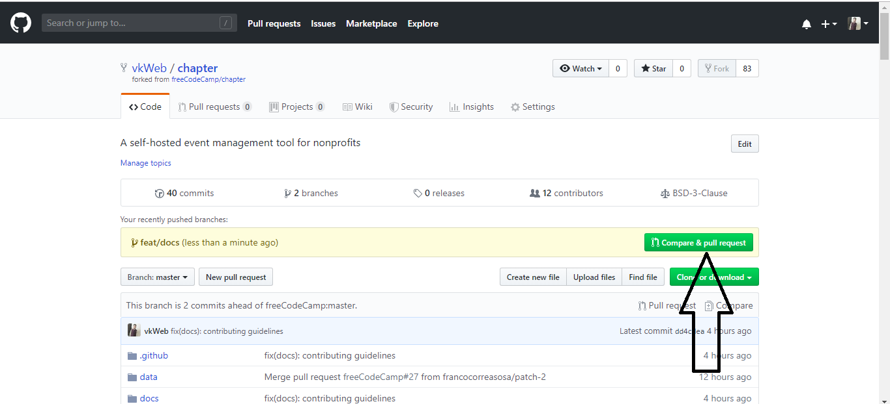

# How to open a Pull Request

## How to prepare a good Pull Request title:

When opening a Pull Request(PR), use the following scope table to decide what to title your PR in the following format:

`fix/feat/chore/refactor/docs/perf (scope): PR Title`

An example is `feat(client): night mode`.

| Scope | Documentation |
|---|---|
| `api` | For Pull Requests making changes to the APIs, routes and its architecture |
| `db` | For Pull Requests making changes related to database |
| `client` | For Pull Requests making changes to client platform logic or user interface |
| `docs` | For Pull Requests making changes to the project's documentation |

## Proposing a Pull Request (PR)

1. Once the edits have been committed & pushed, you will be prompted to create a pull request on your fork's GitHub Page. Click on `Compare and Pull Request`.

    

2. By default, all pull requests should be against the Chapter main repo, `master` branch.

    

3. Submit the pull request from your branch to Chapter's `master` branch.

4. In the body of your PR include a more detailed summary of the changes you made and why.

    - You will be presented with a pull request template. This is a checklist that you should have followed before opening the pull request.

    - Fill in the details as they seem fit to you. This information will be reviewed and a decision will be made whether or not your pull request is going to be accepted.

    - If the PR is meant to fix an existing bug/issue then, at the end of
      your PR's description, append the keyword `closes` and #xxxx (where xxxx
      is the issue number). Example: `closes #1337`. This tells GitHub to
      automatically close the existing issue, if the PR is accepted and merged.

You have successfully created a PR. Congratulations! :tada:
